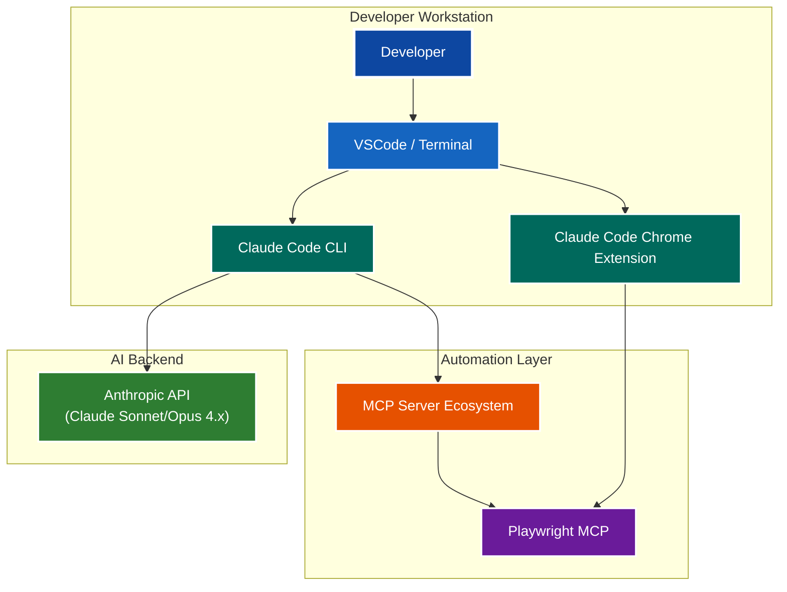
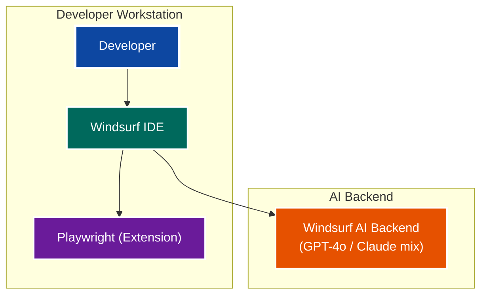
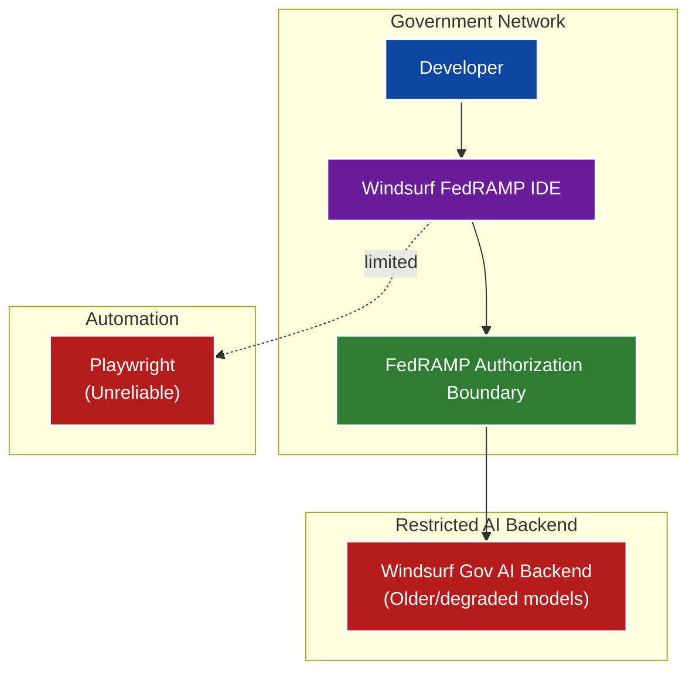
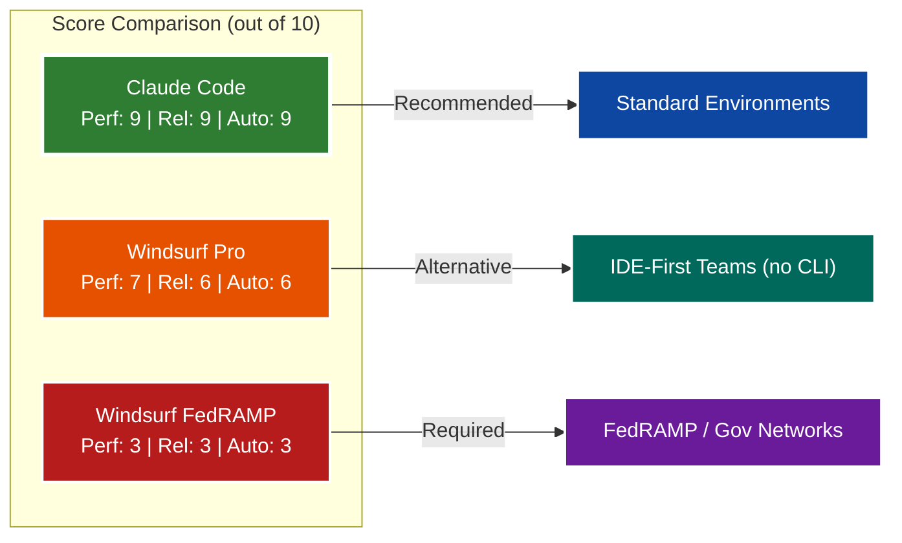

# TEG One-Pager: AI Coding Assistant Tool Selection — Analysis of Alternatives

**Date:** 2026-03-07
**Author:** REI Systems Engineering
**Status:** Proposal

---

## Problem Statement

**Current Situation:**
- Development teams require AI-assisted coding tools for accelerated delivery
- Three candidate platforms exist with materially different capability, reliability, and compliance profiles
- No formal selection criteria established for government/enterprise contexts

**Critical Risks:**
1. **FedRAMP Non-Compliance** — Selecting a tool that cannot operate in government-authorized environments blocks deployment entirely
2. **Unreliable Browser Automation** — Low-reliability tooling degrades AI agent workflows and increases rework
3. **Performance Gaps** — Underperforming AI models slow developer throughput and increase bug introduction risk

**Impact:** Tool selection directly affects developer productivity, compliance posture, and the viability of AI-assisted engineering in regulated environments.

---

## Outcome Expectation

**Primary Goal:** Select an AI coding assistant that delivers high performance, reliability, and browser automation capability while meeting security and compliance requirements.

**Success Metrics:**
- Selected tool scores >= 7/10 across all critical criteria
- FedRAMP authorization met for any government-environment deployments
- Browser automation workflows execute reliably with minimal manual intervention
- Developer adoption >= 80% within 30 days of rollout

---

## Requirements

### Functional Requirements
1. AI code generation, completion, and explanation (inline and chat)
2. Browser automation support (Playwright or equivalent) for AI agent workflows
3. Terminal/CLI integration for agentic task execution
4. Extension ecosystem for IDE and workflow customization

### Non-Functional Requirements
1. **Security:** FedRAMP authorization required for government network use
2. **Reliability:** Tool must operate consistently without frequent outages or degraded responses
3. **Performance:** AI model must produce high-quality, accurate code suggestions
4. **Cost:** Licensing must be justifiable against productivity gains
5. **Compliance:** Data handling must meet government data classification requirements

---

## Design Details

### Options Analysis

| **Criteria** | **Claude Code (CC)** | **Windsurf Pro (WP)** | **Windsurf FedRAMP (WF)** |
|---|---|---|---|
| **Performance** | 9/10 | 7/10 | 3/10 |
| **Reliability** | 9/10 | 6/10 | 3/10 |
| **Browser Automation** | 9/10 (Playwright + Chrome Ext) | 6/10 (Playwright) | 3/10 (unreliable) |
| **FedRAMP Authorized** | ⚠️ Not natively (GovCloud roadmap) | ❌ No | ✅ Yes |
| **Agentic CLI/Terminal** | ✅ Full (claude-code CLI) | ⚠️ Partial | ❌ Limited |
| **Extension Ecosystem** | ✅ Rich (MCP, browser ext) | ✅ Moderate | ❌ Restricted |
| **Model Quality** | ✅ Claude Sonnet/Opus 4.x | ⚠️ GPT-4o / Sonnet (varies) | ❌ Degraded/older models |
| **Offline Capability** | ❌ No | ❌ No | ⚠️ Limited |
| **Cost** | $$$ (API usage-based) | $$ (subscription) | $$ (subscription + FedRAMP premium) |
| **Overall Score** | **9/10** | **6.5/10** | **3/10** |

---

### Alternative 1: Claude Code Ecosystem

**Key Points:**
- Full agentic loop: terminal, browser, file system via MCP
- Claude Code Chrome Extension enables browser automation alongside Playwright MCP
- Powered by Claude Sonnet 4.6 / Opus 4.6 — top-tier code generation quality
- Highest reliability and performance across all criteria

**Pros:**
- ✅ Performance: 9/10 — best-in-class code generation
- ✅ Reliability: 9/10 — stable API with high uptime SLAs
- ✅ Browser automation: 9/10 — Playwright MCP + Chrome extension
- ✅ Full CLI/terminal agentic execution (claude-code)
- ✅ MCP ecosystem: file tools, browser, Slack, databases, and more
- ✅ Active model improvement cadence (Claude 4.x family)

**Cons:**
- ❌ Not FedRAMP authorized (GovCloud roadmap, not yet available)
- ❌ API cost scales with usage — requires usage governance
- ❌ Cannot be used on classified/IL4+ networks today

**Best For:** Standard development environments, enterprise AI workflows, high-throughput agentic automation.

---

### Alternative 2: Windsurf Pro

**Key Points:**
- IDE-first experience (forked from VS Code)
- Supports Playwright for browser automation but without a dedicated extension layer
- AI backend model varies; quality inconsistent compared to Claude Code

**Pros:**
- ✅ Performance: 7/10 — capable for most tasks
- ✅ Familiar IDE experience for VS Code users
- ✅ Subscription pricing predictable
- ✅ Playwright integration available

**Cons:**
- ❌ Reliability: 6/10 — occasional model inconsistencies
- ⚠️ Browser automation: 6/10 — Playwright only, no Chrome extension layer
- ❌ Not FedRAMP authorized
- ⚠️ AI model backend is variable (not always Claude)
- ⚠️ MCP/extension ecosystem less mature than Claude Code

**Best For:** Teams wanting an IDE-integrated AI experience without agentic terminal requirements; moderate automation needs.

---

### Alternative 3: Windsurf FedRAMP

**Key Points:**
- Only option with FedRAMP authorization — required for government network deployments
- AI model performance significantly degraded versus commercial counterparts
- Browser automation available but unreliable in practice

**Pros:**
- ✅ FedRAMP authorized — only viable option for IL2/IL4 government environments
- ✅ Meets government data residency and compliance requirements
- ✅ Subscription pricing

**Cons:**
- ❌ Performance: 3/10 — degraded model quality reduces developer productivity
- ❌ Reliability: 3/10 — frequent issues reported in practice
- ❌ Browser automation: 3/10 — Playwright available but unreliable
- ❌ Restricted extension ecosystem
- ❌ Limited agentic/CLI capability
- ❌ Older/smaller models — lower code quality and reasoning

**Best For:** Environments where FedRAMP compliance is a hard requirement and no alternative exists; accept significant capability trade-offs.

---

## Scoring Summary

---

## Benefits Summary

### For Developers
- ✅ Claude Code: Maximum productivity — best model quality, full agentic loop
- ⚠️ Windsurf Pro: Good productivity — IDE-native but limited automation
- ❌ Windsurf FedRAMP: Significant productivity loss — degraded models and unreliable automation

### For Engineering Management
- ✅ Claude Code: Highest ROI in standard environments; measurable throughput gains
- ⚠️ Windsurf Pro: Moderate ROI; predictable subscription cost
- ⚠️ Windsurf FedRAMP: Compliance necessity only; productivity cost must be accepted

### For Security / Compliance
- ⚠️ Claude Code: Not FedRAMP authorized today — blocked for classified/government networks
- ❌ Windsurf Pro: Not FedRAMP authorized
- ✅ Windsurf FedRAMP: Only compliant option for government network use

---

## Decision Required

### Recommended: Claude Code Ecosystem (Standard Environments)

**Best For:** All non-government-network development. Delivers 9/10 across performance, reliability, and browser automation. Full agentic capability via CLI, MCP, and Chrome extension.

**Trade-off:** Not FedRAMP authorized — cannot be used on government-classified networks today.

---

### Conditional: Windsurf FedRAMP (Government Networks Only)

**Best For:** Any deployment requiring FedRAMP authorization. Accept 3/10 performance and reliability as the cost of compliance.

**Trade-off:** Significant capability degradation. Teams should plan for reduced AI-assisted throughput and manual workarounds for automation failures.

---

### Not Recommended: Windsurf Pro

**Rationale:** Windsurf Pro falls between both options without excelling at either. It is not FedRAMP compliant and underperforms Claude Code on every technical criterion. Not recommended as a primary choice.

---

## Questions for Discussion

1. **Compliance Scope:** Which project environments require FedRAMP authorization? (Determines if WF is mandatory)
2. **Network Boundaries:** Can Claude Code be used on a developer workstation that also accesses government systems, or must the tool itself be FedRAMP-authorized?
3. **Cost Governance:** What usage caps or quotas will be applied to Claude Code API consumption?
4. **Roadmap:** Is Anthropic's GovCloud/FedRAMP roadmap a viable wait-and-see option, or must a decision be made now?
5. **Hybrid Model:** Can teams run Claude Code for standard work and Windsurf FedRAMP only for government-network tasks?

---

## Next Steps

**If Claude Code Approved (Standard Environments):**
1. Provision Anthropic API keys with usage budgets (Week 1)
2. Deploy Claude Code CLI + VS Code extension to developer machines (Week 1)
3. Configure Playwright MCP and Chrome extension for browser automation (Week 2)
4. Establish MCP server standards for team workflows (Week 2-3)
5. Track adoption and productivity metrics at Day 30 (Month 2)

**If Windsurf FedRAMP Required:**
1. Coordinate FedRAMP environment access and licensing (Week 1-2)
2. Document known automation reliability gaps and manual fallbacks (Week 2)
3. Set realistic throughput expectations with project leads (Week 2)
4. Revisit when Claude Code FedRAMP authorization becomes available

---

*Document owner: REI Systems Engineering | Next review: 2026-06-01*