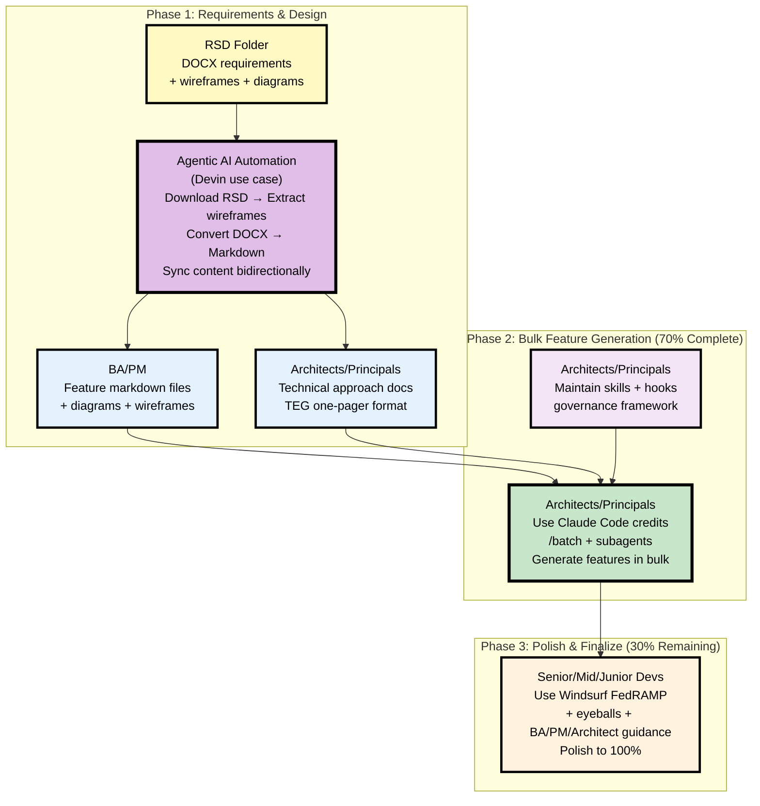
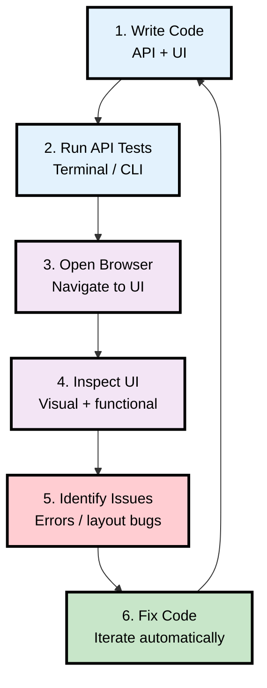
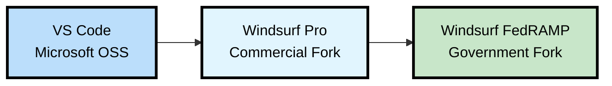
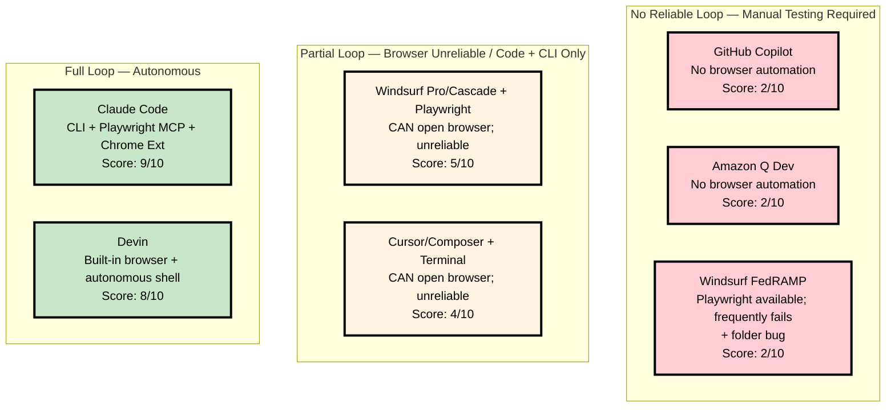

# AI Coding Tools: Executive Brief

---

## Page 1: Productivity Improvement Strategy

### Current State
- **Windsurf FedRAMP**: **20%+ productivity improvement** for many developers
- **Opportunity**: Claude Code can deliver **additional 20%+ improvement** (40%+ total)
- **Strategy**: Layered workflow — architects build bulk features, teams polish

### Proposed Workflow: 70% Automation + 30% Polish

### Why Claude Code Outperforms

#### Native SDK Access = Unmatched Performance

```mermaid
graph TB
    subgraph "Claude Code — First-Class Agentic Loop"
        CC["Claude Code<br/>CLI / VS Code Extension"]
        SDK["Claude SDK<br/>Native API Access<br/>Full model capabilities"]
        AGENT["Subagents + Hooks<br/>Parallel execution<br/>Governance controls"]
    end
    
    subgraph "Other Tools — Forced Through OpenAI API"
        OTHER["Windsurf / Cursor<br/>GitHub Copilot / Amazon Q"]
        OPENAI["OpenAI Completions API<br/>Compatibility layer<br/>Limited capabilities"]
        DEGR["Degraded Performance<br/>No subagents<br/>No governance hooks"]
    end
    
    CC --> SDK
    SDK --> AGENT
    OTHER --> OPENAI
    OPENAI --> DEGR
    
    style CC fill:#c8e6c9,stroke:#000,stroke-width:4px,color:#000
    style SDK fill:#e8f5e9,stroke:#000,stroke-width:3px,color:#000
    style AGENT fill:#dcedc8,stroke:#000,stroke-width:3px,color:#000
    style OTHER fill:#fff3e0,stroke:#000,stroke-width:3px,color:#000
    style OPENAI fill:#ffccbc,stroke:#000,stroke-width:3px,color:#000
    style DEGR fill:#ffcdd2,stroke:#000,stroke-width:3px,color:#000
```

**Key Advantage**: Claude Code uses the native Claude SDK directly. Other tools must use the OpenAI Completions API compatibility layer, which limits access to advanced features like subagents, hooks, and parallel execution.

---

## Page 2: Top Reasons for Claude Code

### 1. **First-Class Agentic Loop** — Full Dev Cycle Automation

**Score: 9/10** — Only Claude Code and Devin complete this autonomously

### 2. **Subagents + Parallel Execution** — Unmatched Speed

- **Analyze + Test + Implement simultaneously** in a single session
- **Batch processing** via `/batch` command for bulk feature generation
- **Governance hooks** intercept every lifecycle event for approval gates

### 3. **Skill Sharing Across Entire Org** — Force Multiplier

- **CLAUDE.md skill docs** stored in git — instantly shareable org-wide
- **BA-trained doc skills**, **QC Playwright skills**, **architect estimation workflows** available to all roles
- **No other tool has structured cross-role skill distribution**

### 4. **Serves Every Role** — Not Just Developers

| Role | Access Method | Use Case |
|------|---------------|----------|
| **Architects/Principals** | CLI + VS Code | Bulk feature generation, skills/hooks design, technical docs |
| **Developers** | CLI + VS Code | Daily coding, testing, debugging |
| **BA/PM** | Desktop app + VS Code | Requirements docs, feature specs, codebase Q&A |
| **QA** | Playwright MCP | Automated browser testing |
| **Executives** | Desktop + Mobile | Slide decks, reports, data analysis |

### 5. **Performance & Reliability**

- **Native Claude SDK access** — no OpenAI API compatibility layer
- **Low CPU overhead** — runs natively in VS Code or terminal
- **9/10 reliability score** — stable API with high uptime SLAs

### Recommended Action

1. **Pilot Claude Code** with architects/principals for bulk feature generation
2. **Maintain Windsurf FedRAMP** for junior/mid developers and FedRAMP compliance
3. **Establish skill library** — architects create reusable CLAUDE.md workflows
4. **Measure productivity** — track 70% automation target in Phase 2
5. **Scale org-wide** after successful pilot (3–6 months)

---

## Appendix A: Claude Code Updates Since December 2026

### Major Improvements

**Native IDE Extension (Not a Fork)**
- **VS Code Extension**: Native integration directly into VS Code (not a fork like Windsurf)
- **Also supports Cursor**: Same extension works in both VS Code and Cursor IDEs
- **Performance**: Significantly better than fork-based architectures — lower CPU overhead, faster startup
- **Polished Features**: Production-ready UI with inline diffs, plan review, @-mentions, keyboard shortcuts

### Key Features Added (v2.1.x Series)

| Feature | Description | Impact |
|---------|-------------|--------|
| **Auto-memory** | Claude automatically saves useful context; manage with `/memory` | Persistent knowledge across sessions |
| **Batch processing** | `/batch` and `/simplify` commands for bulk operations | Architects can generate multiple features simultaneously |
| **Loop command** | `/loop 5m check deploy` — recurring prompts on interval | Continuous monitoring and automation |
| **HTTP hooks** | POST JSON to URLs instead of shell commands; custom headers | Enterprise integration without scripts |
| **Git worktrees** | `--worktree` flag for isolated parallel tasks | Multiple features in parallel without branch conflicts |
| **Background agents** | Agents run in background; Ctrl+F to kill | Non-blocking bulk operations |
| **Voice push-to-talk** | Rebindable voice activation (default: space) | Hands-free coding |
| **Extended thinking** | Toggle via `/` menu for complex reasoning | Better architecture decisions |
| **1M context window** | Full 1M tokens in Opus 4.6 fast mode | Entire large codebases in context |

### Performance & Reliability Improvements

- **Memory leak fixes**: 15+ leaks fixed (hooks, MCP cache, WebSocket, file count, etc.)
- **Startup optimization**: Deferred image processing, cached auth failures, headless mode improvements
- **Multi-instance stability**: Fixed config corruption, plugin loss, OAuth race conditions
- **Windows stability**: Fixed crashes, EINVAL errors, ARM64 issues
- **Bridge reconnection**: Laptop wake from sleep reconnects in seconds (was 10 minutes)

### Roadmap Highlights (2026+)

- **Remote Control**: CLI remote control for external builds and CI/CD integration
- **Cron scheduling**: Recurring prompts within sessions for automated workflows
- **Plugin marketplace**: Custom npm registries, version pinning, 120s git timeout
- **Managed settings**: macOS plist / Windows Registry for enterprise deployment
- **OAuth improvements**: Step-up auth, discovery caching, manual URL fallback

### Why This Matters

**December 2026 marked a maturity inflection point:**
- **Before**: Early beta, frequent crashes, limited enterprise features
- **After**: Production-grade stability, enterprise governance (hooks, permissions, managed settings), native IDE integration

**Competitive advantage over forks:**
- Windsurf (fork of VS Code) carries architectural debt and CPU overhead
- Claude Code (native extension) integrates cleanly with zero fork maintenance burden
- Performance gap has widened significantly since December 2026

---

## Appendix B: Windsurf FedRAMP Technical Details

### Architecture: Fork Chain

**Fork of a Fork**: VS Code → Windsurf Pro → Windsurf FedRAMP

### Known Issues

| Issue | Impact | Severity |
|-------|--------|----------|
| **Working-folder bug** | Agent escapes project root, reads/writes outside intended directory | 🔴 **High** — Data integrity & security risk |
| **Browser automation failures** | Playwright available but frequently fails; manual retries required | 🟡 **Medium** — Workflow disruption |
| **No top-up flexibility** | Contract-governed limits; 4–8 week procurement to expand | 🟡 **Medium** — Sprint blockers |
| **Performance overhead** | Fork architecture adds CPU load vs native tools | 🟡 **Medium** — Developer experience |

### Test Automation Comparison

