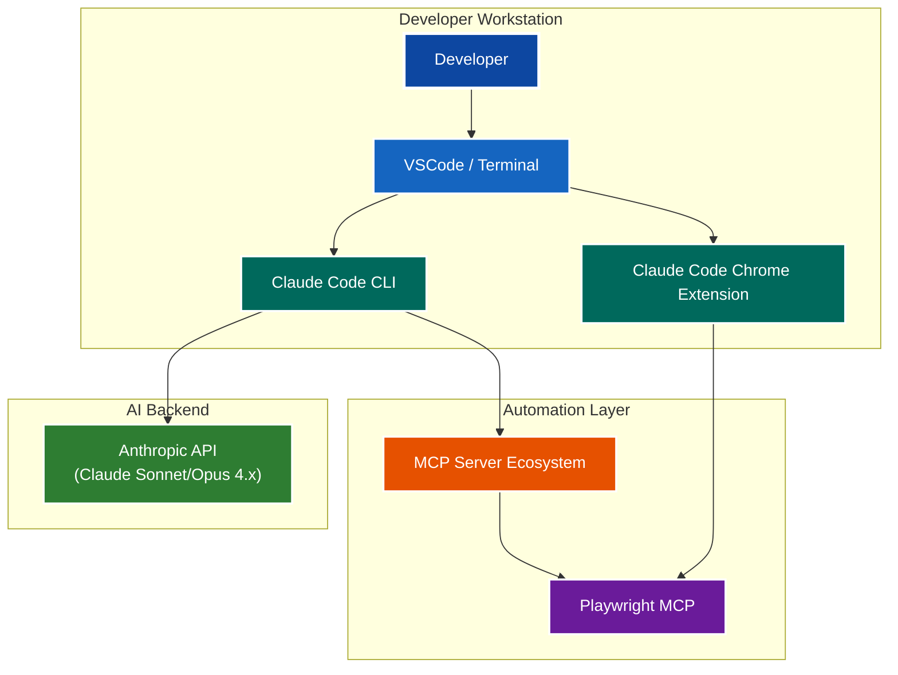
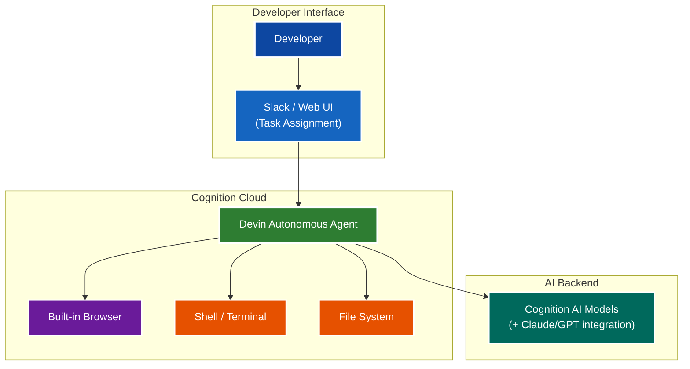
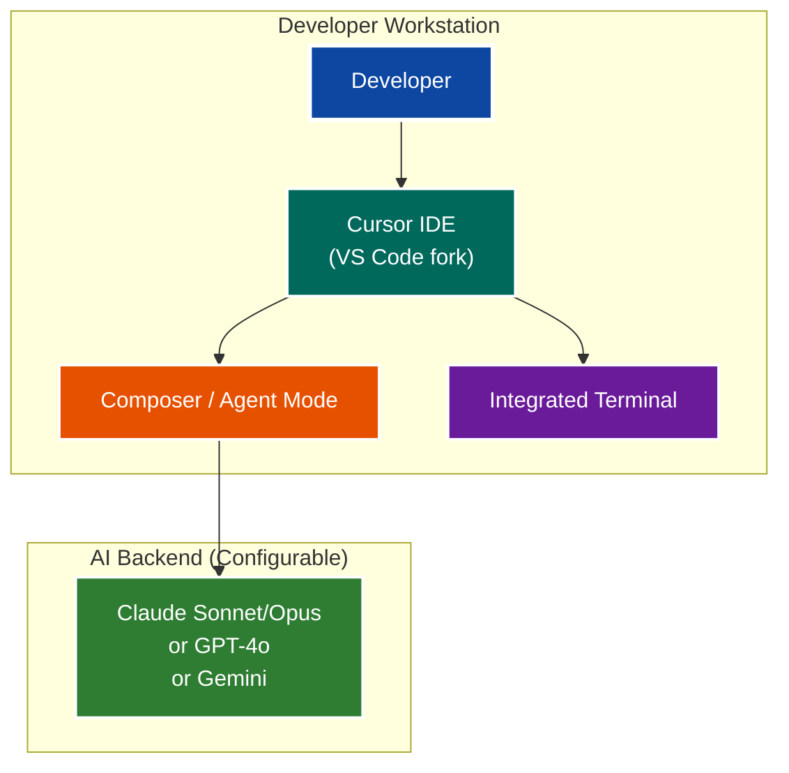
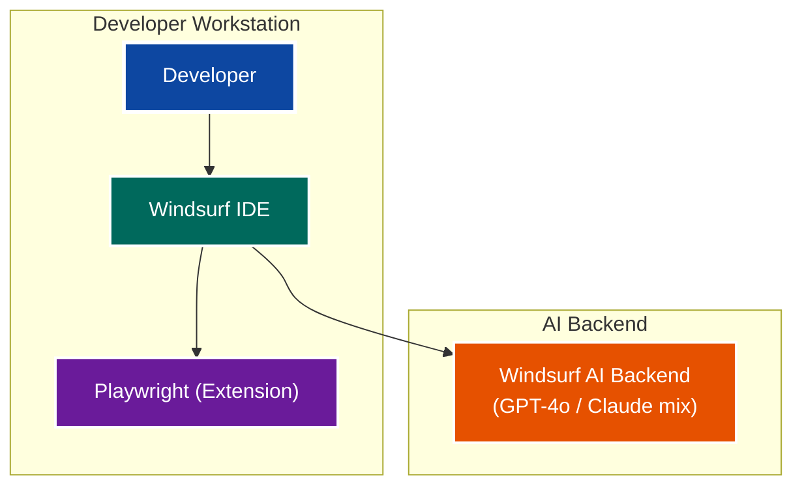
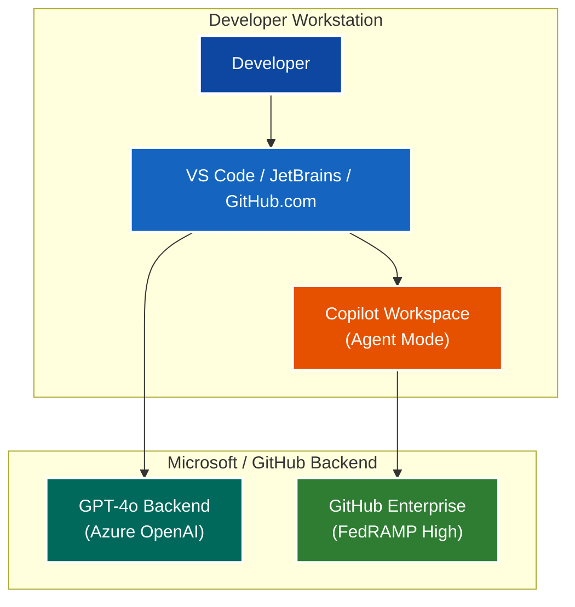
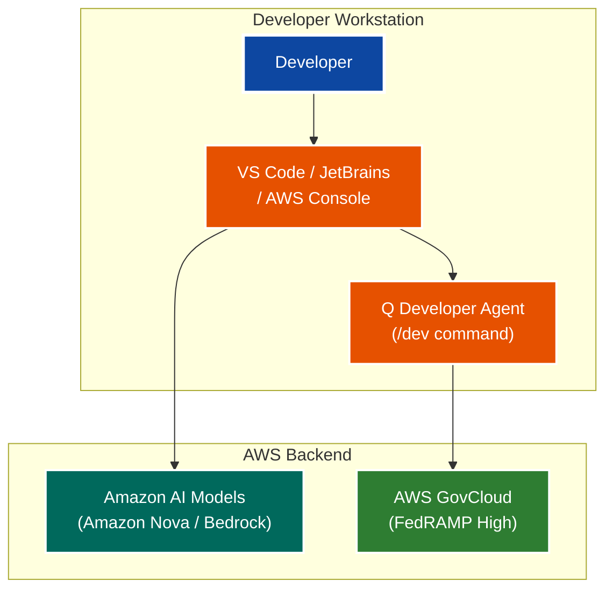
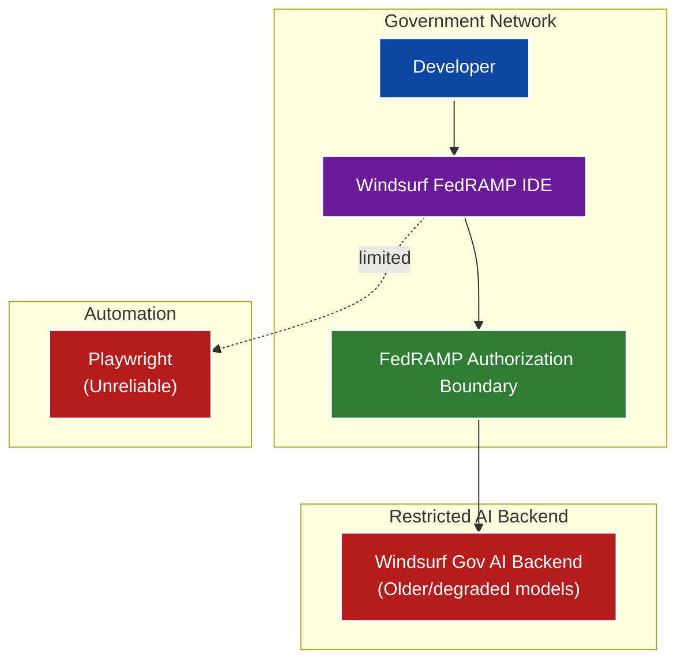
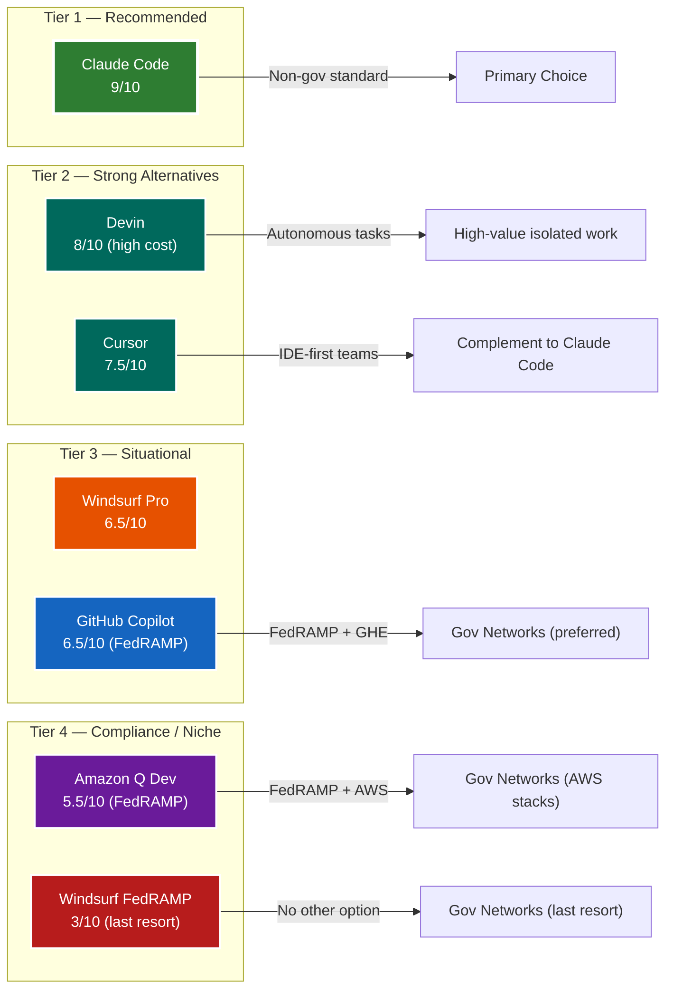

# TEG One-Pager: AI Coding Assistant Tool Selection — Analysis of Alternatives

**Date:** 2026-03-07
**Author:** REI Systems Engineering
**Status:** Proposal

---

## Executive Summary

Seven AI coding assistant platforms were evaluated across performance, reliability, browser automation, FedRAMP compliance, agentic capability, and cost. The field splits cleanly into two decision contexts: **standard development environments** and **FedRAMP-regulated government networks**.

### Key Takeaways

1. **Claude Code is the clear leader for standard environments.** It scores 9/10 across performance, reliability, and browser automation — no other tool evaluated matches it on all three. The MCP ecosystem and Chrome extension make it the only tool with a complete agentic loop out of the box.

2. **FedRAMP compliance eliminates most options.** Only GitHub Copilot (via GitHub Enterprise), Amazon Q Developer (via AWS GovCloud), and Windsurf FedRAMP hold FedRAMP authorization. Of these, GitHub Copilot offers the best capability trade-off. Windsurf FedRAMP is a last resort.

3. **Devin is purpose-built for autonomous task execution, not daily use.** At $500/seat/month it is 10x more expensive than IDE assistants. ROI is only justifiable for well-scoped, high-complexity feature builds.

4. **Cursor is the best IDE-native complement to Claude Code.** It is model-configurable (including Claude backends), cost-effective at $20/month, and ideal for teams who prefer an embedded IDE experience over terminal-first workflows.

5. **Windsurf Pro has no differentiated advantage.** It is outperformed by Cursor at similar price and is not FedRAMP compliant. Not recommended.

6. **Amazon Q Developer is only competitive in AWS-centric stacks.** Its model quality trails the field for general-purpose coding but adds meaningful value for CDK, CloudFormation, and Lambda patterns under FedRAMP.

### Recommendations at a Glance

| Environment | Recommended Tool | Rationale |
|---|---|---|
| Standard development | **Claude Code** | 9/10 across all criteria; best agentic ecosystem |
| IDE-first / complement | **Cursor** | Model-flexible, $20/mo, strong multi-file agent |
| Autonomous task execution | **Devin** (selective) | High cost — pilot before committing |
| FedRAMP — general | **GitHub Copilot** (GHE) | Best capability/compliance balance |
| FedRAMP — AWS stacks | **Amazon Q Developer** | GovCloud authorized, strong for AWS IaC |
| FedRAMP — last resort | **Windsurf FedRAMP** | Only if GHE and Q are not viable |
| Not recommended | **Windsurf Pro** | No differentiated value vs. Cursor |

---

## Problem Statement

**Current Situation:**
- Development teams require AI-assisted coding tools for accelerated delivery
- Seven candidate platforms exist with materially different capability, reliability, and compliance profiles
- No formal selection criteria established for government/enterprise contexts

**Critical Risks:**
1. **FedRAMP Non-Compliance** — Selecting a tool that cannot operate in government-authorized environments blocks deployment entirely
2. **Unreliable Browser Automation** — Low-reliability tooling degrades AI agent workflows and increases rework
3. **Performance Gaps** — Underperforming AI models slow developer throughput and increase bug introduction risk
4. **Cost Misalignment** — Autonomous-agent tools (Devin) carry per-seat costs 10x+ higher than IDE-assistant tools

**Impact:** Tool selection directly affects developer productivity, compliance posture, automation capability, and budget.

---

## Outcome Expectation

**Primary Goal:** Select an AI coding assistant that delivers high performance, reliability, and browser automation capability while meeting security and compliance requirements.

**Success Metrics:**
- Selected tool scores >= 7/10 across all critical criteria
- FedRAMP authorization met for any government-environment deployments
- Browser automation workflows execute reliably with minimal manual intervention
- Developer adoption >= 80% within 30 days of rollout
- Licensing cost justified by measurable productivity gain

---

## Requirements

### Functional Requirements
1. AI code generation, completion, and explanation (inline and chat)
2. Browser automation support (Playwright or equivalent) for AI agent workflows
3. Terminal/CLI integration for agentic task execution
4. Extension ecosystem for IDE and workflow customization

### Non-Functional Requirements
1. **Security:** FedRAMP authorization required for government network use
2. **Reliability:** Tool must operate consistently without frequent outages or degraded responses
3. **Performance:** AI model must produce high-quality, accurate code suggestions
4. **Cost:** Licensing must be justifiable against productivity gains
5. **Compliance:** Data handling must meet government data classification requirements

---

## Design Details

### Options Analysis — Full Comparison

| **Criteria** | **Claude Code** | **Devin** | **Cursor** | **Windsurf Pro** | **GitHub Copilot** | **Amazon Q Dev** | **Windsurf FedRAMP** |
|---|---|---|---|---|---|---|---|
| **Performance** | 9/10 | 8/10 | 8/10 | 7/10 | 7/10 | 6/10 | 3/10 |
| **Reliability** | 9/10 | 7/10 | 7/10 | 6/10 | 9/10 | 8/10 | 3/10 |
| **Browser Automation** | 9/10 | 9/10 | 4/10 | 6/10 | 3/10 | 2/10 | 3/10 |
| **FedRAMP Authorized** | ⚠️ Roadmap | ❌ No | ❌ No | ❌ No | ✅ Yes (GHE) | ✅ Yes (GovCloud) | ✅ Yes |
| **Agentic CLI/Terminal** | ✅ Full | ✅ Fully Autonomous | ✅ Composer/Agent | ⚠️ Partial | ⚠️ Limited | ⚠️ Limited | ❌ Minimal |
| **Extension Ecosystem** | ✅ Rich (MCP) | ⚠️ Proprietary | ✅ Moderate | ✅ Moderate | ✅ Rich (GH ecosystem) | ⚠️ AWS-centric | ❌ Restricted |
| **Model Quality** | ✅ Claude 4.x | ✅ Proprietary + Claude | ✅ Configurable (Claude/GPT) | ⚠️ Variable | ⚠️ GPT-4o | ⚠️ Amazon models | ❌ Degraded |
| **Offline Capability** | ❌ No | ❌ No | ❌ No | ❌ No | ❌ No | ❌ No | ⚠️ Limited |
| **Pricing Model** | API usage-based | Per seat/month | Per seat/month | Per seat/month | Per seat/month | Per seat/month | Per seat/month |
| **Individual / Team** | $3/M (Sonnet) – $15/M (Opus) tokens | $500/seat/mo | $20/seat/mo | $15/seat/mo | $19/seat/mo (Ind.) / $39/seat/mo (Ent.) | $19/seat/mo (free tier avail.) | ~$15/seat/mo + FedRAMP overhead |
| **Est. Cost / Dev / Mo** | ~$50–200 (moderate use) | $500 (fixed) | $20 | $15 | $19–39 | $19 (or free) | ~$15–30 |
| **Overall Score** | **9/10** | **8/10** | **7.5/10** | **6.5/10** | **6.5/10** | **5.5/10** | **3/10** |

---

### Alternative 1: Claude Code Ecosystem *(Recommended)*

**Key Points:**
- Full agentic loop: terminal, browser, file system via MCP
- Claude Code Chrome Extension enables browser automation alongside Playwright MCP
- Powered by Claude Sonnet 4.6 / Opus 4.6 — top-tier code generation quality
- MCP ecosystem extends to Slack, databases, Git, and custom tooling

**Pros:**
- ✅ Performance: 9/10 — best-in-class code generation
- ✅ Reliability: 9/10 — stable API with high uptime SLAs
- ✅ Browser automation: 9/10 — Playwright MCP + Chrome extension
- ✅ Full CLI/terminal agentic execution (claude-code)
- ✅ Richest MCP extension ecosystem of any tool evaluated
- ✅ Active model improvement cadence (Claude 4.x family)

**Cons:**
- ❌ Not FedRAMP authorized (GovCloud roadmap, not yet available)
- ❌ API cost scales with usage — requires usage governance
- ❌ Cannot be used on classified/IL4+ networks today

**Best For:** Standard development environments, enterprise AI workflows, high-throughput agentic automation.

---

### Alternative 2: Devin (Cognition AI)

**Key Points:**
- Fully autonomous AI software engineer — operates independently in a cloud environment
- Assigned tasks via Slack or web UI; executes end-to-end without developer intervention
- Has its own browser, shell, and file system — highest autonomy of any tool evaluated
- Best suited for well-scoped, isolated tasks; can go off-rails on ambiguous requirements

**Pros:**
- ✅ Performance: 8/10 — handles complex multi-step coding tasks autonomously
- ✅ Browser automation: 9/10 — built-in browser, no external Playwright setup needed
- ✅ Fully autonomous — frees developers from repetitive implementation work
- ✅ Native Slack integration for task assignment

**Cons:**
- ❌ Cost: $$$$ — ~$500/seat/month, 10x+ higher than IDE-assistant tools
- ❌ Not FedRAMP authorized
- ⚠️ Reliability: 7/10 — can fail on ambiguous or under-specified tasks
- ⚠️ Proprietary cloud environment — limited auditability and control
- ❌ Not suitable for sensitive code or air-gapped environments
- ⚠️ Requires careful task scoping; autonomous failures can compound

**Best For:** High-value, well-scoped autonomous tasks (e.g., "build this feature end-to-end") where developer time is more expensive than tooling cost. Not a daily-driver replacement.

---

### Alternative 3: Cursor

**Key Points:**
- VS Code fork with deep AI integration at the IDE level
- Model-agnostic: configurable to use Claude, GPT-4o, or Gemini backends
- Composer/Agent mode enables multi-file agentic edits with terminal access
- Strong inline autocomplete + chat; lacks native browser automation layer

**Pros:**
- ✅ Performance: 8/10 — excellent when configured with Claude backend
- ✅ Model flexibility — choose best model per task
- ✅ Strong Composer agent for multi-file refactors
- ✅ Predictable subscription cost (~$20/month)
- ✅ Familiar VS Code experience with AI deeply embedded

**Cons:**
- ❌ Not FedRAMP authorized
- ⚠️ Browser automation: 4/10 — no native browser extension; relies on external tools
- ⚠️ Reliability: 7/10 — smaller infra than Microsoft or Anthropic
- ⚠️ Agent mode less mature than Claude Code CLI for complex terminal workflows
- ❌ No MCP ecosystem equivalent

**Best For:** Teams wanting best-in-class IDE experience with model flexibility and strong multi-file agent edits. Excellent Claude Code complement for developers who prefer an IDE over CLI.

---

### Alternative 4: Windsurf Pro

**Key Points:**
- IDE-first experience (forked from VS Code)
- Supports Playwright for browser automation but without a dedicated extension layer
- AI backend model varies; quality inconsistent compared to Claude Code and Cursor

**Pros:**
- ✅ Performance: 7/10 — capable for most tasks
- ✅ Familiar IDE experience for VS Code users
- ✅ Subscription pricing predictable (~$15/month)
- ✅ Playwright integration available

**Cons:**
- ❌ Reliability: 6/10 — occasional model inconsistencies
- ⚠️ Browser automation: 6/10 — Playwright only, no Chrome extension layer
- ❌ Not FedRAMP authorized
- ⚠️ AI model backend is variable (not always Claude)
- ⚠️ Weaker extension ecosystem vs. Claude Code and Cursor

**Best For:** Teams wanting an IDE-integrated AI experience without agentic terminal requirements; moderate automation needs. Largely superseded by Cursor at similar price.

---

### Alternative 5: GitHub Copilot

**Key Points:**
- Most widely deployed enterprise AI coding tool globally
- FedRAMP High authorization available via GitHub Enterprise + Azure GovCloud
- Deeply integrated into GitHub platform (PRs, issues, Actions)
- Strong inline autocomplete; agent/autonomous mode (Copilot Workspace) still maturing

**Pros:**
- ✅ FedRAMP authorized via GitHub Enterprise (GHE) — viable government option
- ✅ Reliability: 9/10 — Microsoft Azure infrastructure, enterprise SLAs
- ✅ Broadest IDE support (VS Code, JetBrains, Visual Studio, Neovim)
- ✅ GitHub platform integration (PR reviews, issue resolution, Actions)
- ✅ Familiar to most developers — lowest adoption friction
- ✅ Predictable per-seat pricing ($19–39/month)

**Cons:**
- ⚠️ Performance: 7/10 — GPT-4o based; strong but not best-in-class for complex tasks
- ❌ Browser automation: 3/10 — no native browser automation capability
- ⚠️ Agentic CLI: 5/10 — Copilot Workspace improving but not production-grade yet
- ⚠️ FedRAMP path requires full GHE licensing — adds cost and procurement complexity
- ⚠️ Model locked to GPT-4o — no Claude option

**Best For:** Organizations already on GitHub Enterprise seeking a compliant, low-friction AI coding tool. Best FedRAMP option when browser automation is not a requirement.

---

### Alternative 6: Amazon Q Developer

**Key Points:**
- FedRAMP High authorized via AWS GovCloud — strongest compliance posture of all options
- Optimized for AWS service integration (CDK, CloudFormation, Lambda, S3)
- `/dev` agent mode handles multi-file feature implementation
- Model quality trails Claude and GPT-4o; best in class for AWS-specific patterns

**Pros:**
- ✅ FedRAMP High via AWS GovCloud — strongest compliance posture evaluated
- ✅ Reliability: 8/10 — AWS infrastructure
- ✅ Optimized for AWS-centric codebases and IaC
- ✅ Free tier available; paid tier ~$19/month
- ✅ Broad IDE support (VS Code, JetBrains, CLI)

**Cons:**
- ⚠️ Performance: 6/10 — Amazon models lag Claude/GPT-4o on general coding tasks
- ❌ Browser automation: 2/10 — essentially none
- ⚠️ Agentic CLI: 5/10 — `/dev` agent improving but limited vs. Claude Code
- ❌ Weak value outside AWS ecosystem; poor for Salesforce, .NET, or non-AWS stacks
- ⚠️ Extension ecosystem AWS-centric — limited MCP/third-party integrations

**Best For:** AWS-heavy shops requiring FedRAMP compliance where GitHub Copilot is not already in use. Poor fit for non-AWS stacks.

---

### Alternative 7: Windsurf FedRAMP *(Compliance-Only)*

**Key Points:**
- FedRAMP authorized — required for government network deployments where GHE/AWS Q are not options
- AI model performance significantly degraded versus commercial counterparts
- Browser automation available but unreliable in practice
- Weakest overall option evaluated; included for completeness

**Pros:**
- ✅ FedRAMP authorized — valid for IL2/IL4 environments
- ✅ Meets government data residency and compliance requirements

**Cons:**
- ❌ Performance: 3/10 — degraded model quality
- ❌ Reliability: 3/10 — frequent instability
- ❌ Browser automation: 3/10 — Playwright available but unreliable
- ❌ Restricted extension ecosystem
- ❌ Limited agentic/CLI capability
- ❌ Older/smaller models — lowest code quality of all options evaluated

**Best For:** Government environments where GHE and Amazon Q are not viable and FedRAMP is a hard requirement. Last resort only.

---

## Scoring Summary

---

## Benefits Summary

### For Developers
- ✅ Claude Code: Maximum productivity — best model, full agentic loop, MCP ecosystem
- ✅ Devin: Maximum autonomy — hands-off execution, high cost justified for right tasks
- ✅ Cursor: Best IDE-native AI experience; model-configurable
- ⚠️ GitHub Copilot: Good inline completions; low adoption friction; weak automation
- ⚠️ Windsurf Pro: Functional but outclassed by Cursor at similar price
- ⚠️ Amazon Q: Strong only on AWS-centric code
- ❌ Windsurf FedRAMP: Productivity loss; use only when required

### For Engineering Management
- ✅ Claude Code: Highest ROI in standard environments
- ⚠️ Devin: Very high cost — ROI only for well-scoped autonomous tasks
- ✅ Cursor: Strong ROI, predictable cost, complements Claude Code
- ✅ GitHub Copilot: Best enterprise cost/compliance balance (if GHE in place)
- ⚠️ Amazon Q: Good ROI for AWS shops only
- ⚠️ Windsurf FedRAMP: Compliance necessity; accept productivity cost

### For Security / Compliance
- ✅ GitHub Copilot: FedRAMP High via GHE — preferred government option
- ✅ Amazon Q Developer: FedRAMP High via AWS GovCloud — strongest posture
- ✅ Windsurf FedRAMP: FedRAMP authorized (weakest capability)
- ⚠️ Claude Code: Not FedRAMP today; GovCloud roadmap in progress
- ❌ Devin, Cursor, Windsurf Pro: Not FedRAMP authorized

---

## Decision Required

### Recommended: Claude Code Ecosystem (Standard Environments)

**Best For:** All non-government-network development. Highest performance, reliability, and browser automation. Full agentic capability via CLI, MCP, and Chrome extension.

**Trade-off:** Not FedRAMP authorized. Cannot be used on government-classified networks today.

---

### Complementary: Cursor (IDE-First Teams)

**Best For:** Developers who prefer an IDE-native experience over terminal-first workflows. Use alongside Claude Code — Cursor for IDE editing, Claude Code for complex agentic tasks.

**Trade-off:** No browser automation; not FedRAMP authorized.

---

### Selective: Devin (Autonomous Task Execution)

**Best For:** Well-scoped, isolated feature builds or bug-fix sprints where developer time cost exceeds $500/month equivalent. Not a general-purpose replacement.

**Trade-off:** Very high cost, proprietary environment, no FedRAMP.

---

### Conditional: GitHub Copilot (FedRAMP — Preferred)

**Best For:** Government-network deployments where GHE is already licensed or where Microsoft infrastructure is preferred. Best compliance/capability trade-off for regulated environments.

**Trade-off:** Weak browser automation; GPT-4o model only.

---

### Conditional: Amazon Q Developer (FedRAMP — AWS Stacks)

**Best For:** AWS-centric teams requiring FedRAMP where GHE is not in use.

**Trade-off:** Poor general-purpose performance outside AWS ecosystem.

---

### Not Recommended: Windsurf Pro

**Rationale:** Outperformed by Cursor at similar price. Not FedRAMP compliant. No differentiated capability.

---

### Last Resort: Windsurf FedRAMP

**Rationale:** Weakest capability of all options evaluated. Use only when GHE (Copilot) and Amazon Q are not viable and FedRAMP is a hard requirement.

---

## Questions for Discussion

1. **Compliance Scope:** Which project environments require FedRAMP authorization?
2. **Network Boundaries:** Can Claude Code run on workstations that also access government systems, or must the tool itself be FedRAMP-authorized?
3. **GitHub Enterprise Status:** Is GHE already licensed? If yes, GitHub Copilot FedRAMP is the lowest-friction compliant option.
4. **AWS Stack:** Is the codebase AWS-centric? If yes, Amazon Q adds extra value for infrastructure work.
5. **Devin Pilot:** Is there budget to pilot Devin for a defined set of autonomous tasks to validate ROI at the $500/seat cost?
6. **Hybrid Model:** Can teams run Claude Code for standard work and a FedRAMP tool only for government-network sessions?
7. **Anthropic Roadmap:** Is waiting for Claude Code FedRAMP authorization a viable option given project timelines?

---

## Next Steps

**If Claude Code Approved (Standard Environments):**
1. Provision Anthropic API keys with usage budgets (Week 1)
2. Deploy Claude Code CLI + VS Code extension to developer machines (Week 1)
3. Configure Playwright MCP and Chrome extension for browser automation (Week 2)
4. Establish MCP server standards for team workflows (Week 2–3)
5. Evaluate Cursor as a complementary IDE tool for preference-based adoption (Week 3)
6. Track adoption and productivity metrics at Day 30 (Month 2)

**If FedRAMP Required (Government Networks):**
1. Confirm whether GitHub Enterprise is already licensed — if yes, activate Copilot FedRAMP immediately (Week 1)
2. If AWS-centric stack and no GHE: procure Amazon Q Developer via AWS GovCloud (Week 1–2)
3. If neither GHE nor AWS Q viable: proceed with Windsurf FedRAMP as interim (Week 2)
4. Document automation reliability gaps and manual fallbacks for any FedRAMP tool (Week 2)
5. Revisit when Claude Code FedRAMP authorization becomes available

**If Devin Pilot Approved:**
1. Define 3–5 well-scoped autonomous tasks for 30-day pilot (Week 1)
2. Assign Cognition AI seats and configure Slack integration (Week 1)
3. Measure output quality, autonomy rate, and developer time saved vs. cost (Month 1)
4. Make permanent adoption decision based on pilot ROI (Month 2)

---

*Document owner: REI Systems Engineering | Next review: 2026-06-01*
