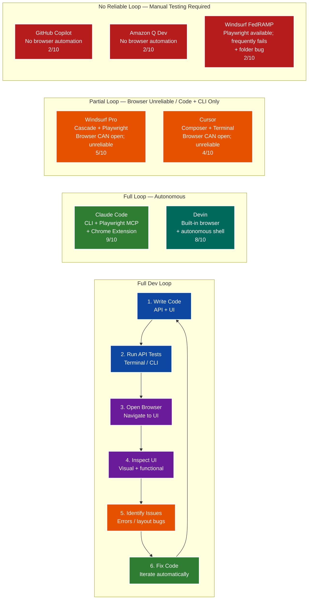
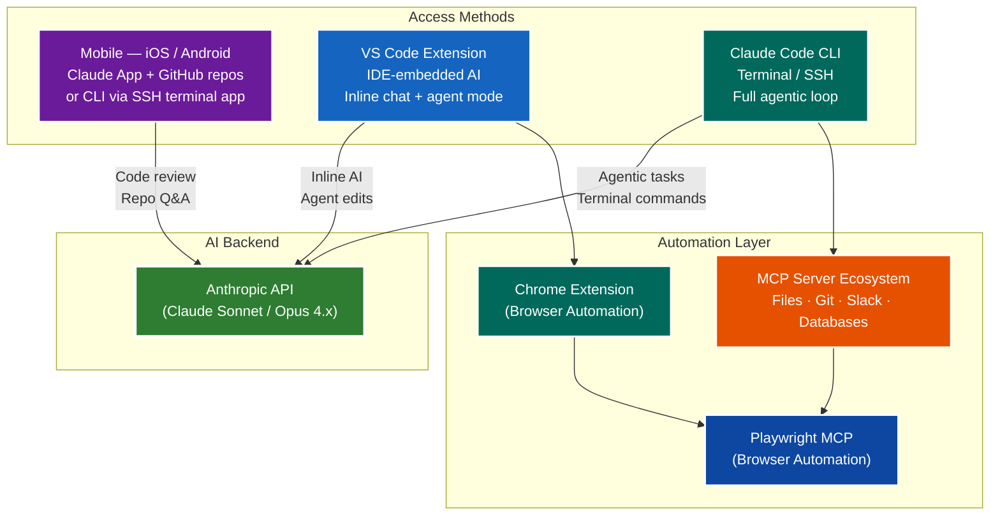
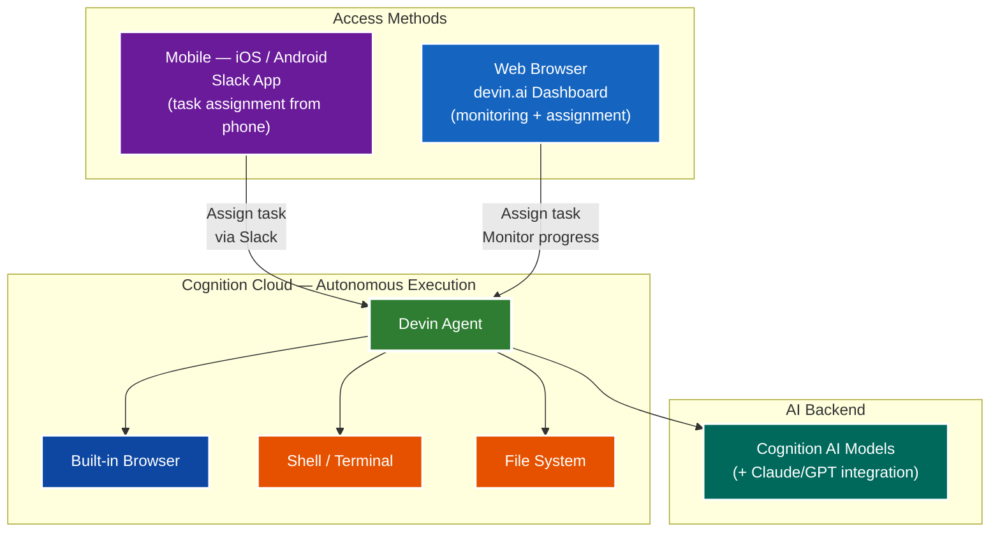
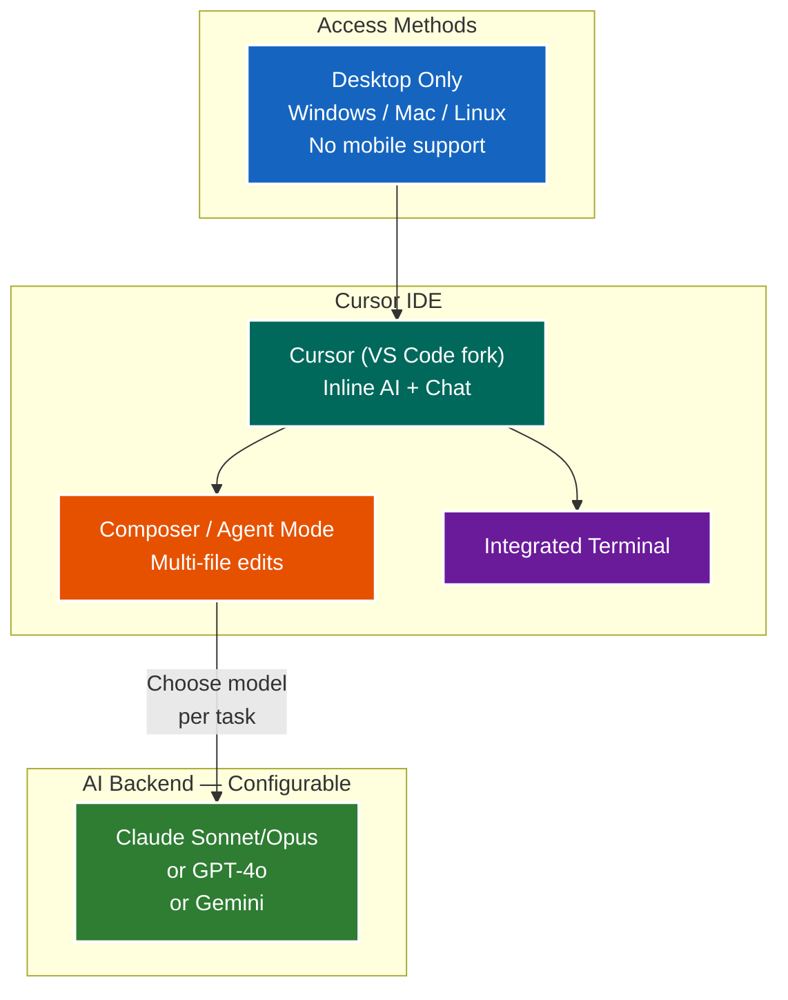
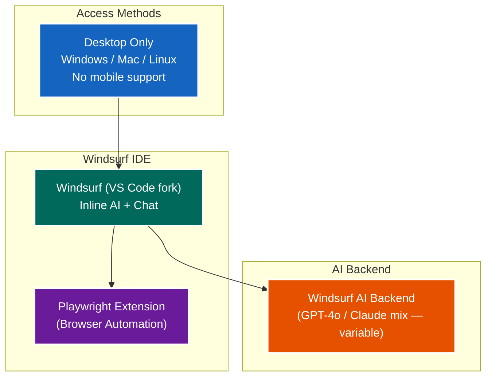
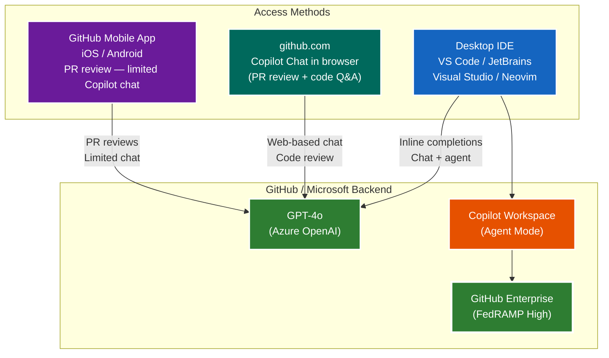
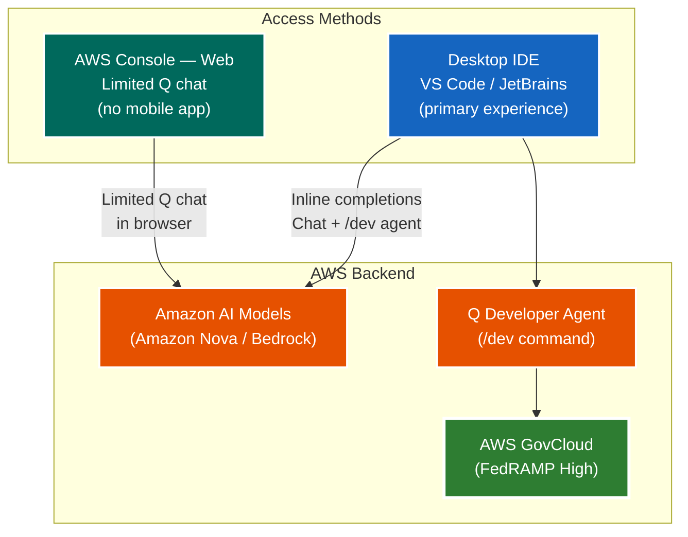
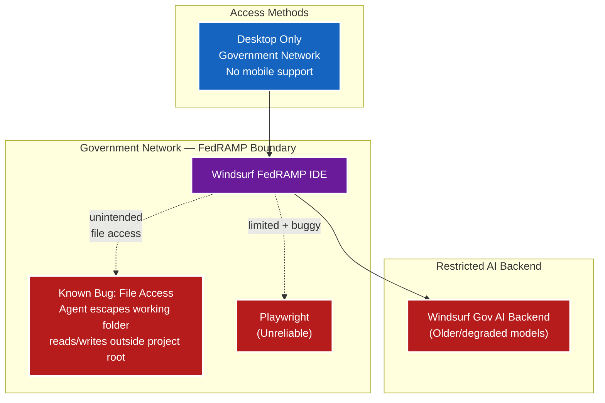
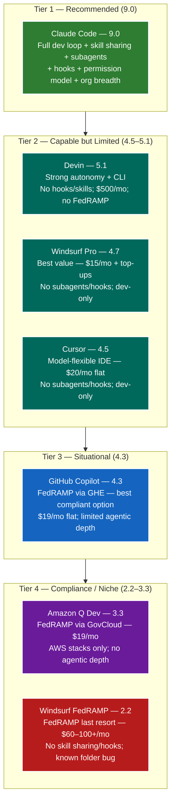

# TEG One-Pager: AI Coding Assistant Tool Selection — Analysis of Alternatives

**Date:** 2026-03-07
**Author:** Engineering
**Status:** Proposal

---

## Executive Summary

Seven AI coding assistant platforms were evaluated across performance, reliability, browser automation, skill sharing, subagent orchestration, hook-based lifecycle customization, permission models, FedRAMP compliance, agentic capability, and cost. The field splits cleanly into two decision contexts: **standard development environments** and **FedRAMP-regulated government networks**.

### Key Takeaways

1. **The full dev loop is the primary selection criterion.** The ability to write code, run an API, open a browser, test the UI, identify issues, and fix them — all in a single uninterrupted agentic session — is the highest-value capability evaluated. Only **Claude Code** and **Devin** complete this loop autonomously and reliably. Cursor and Windsurf Pro handle code + terminal testing well and **CAN open a browser via Playwright**, but browser automation is unreliable in practice — frequently failing and requiring retries; browser testing often requires manual intervention. GitHub Copilot and Amazon Q have no browser automation and require fully manual testing. Windsurf FedRAMP has Playwright but it fails frequently, compounded by the known working-folder bug. **This is a limiting factor for QC/QA workflows.** **Claude Code is the clear leader**: Playwright MCP + Chrome Extension + CLI gives it a 9/10 full dev loop score, three access modes (CLI, VS Code Extension, Mobile), and the deepest automation stack of any tool evaluated.

2. **Script execution is the essential escape hatch for agentic AI.** The ability to write a Python, PowerShell, or Bash script and run it within a single agentic session is the key mechanism for tasks no MCP server covers — connecting to databases, calling proprietary APIs, one-off data transforms, or complex automation chains. Claude Code, Devin, Cursor, and Windsurf Pro all support full script execution autonomously. GitHub Copilot and Amazon Q can generate scripts but execution requires a manual step. Windsurf FedRAMP has severely restricted script execution in its government environment. Skills that combine script execution with AI context (e.g., CLAUDE.md skill docs + MCP tools) multiply this capability into repeatable, team-wide automation.

3. **Claude Code has the strongest plans and skills support of any tool evaluated.** Native task planning via TodoWrite, CLAUDE.md skill docs, MCP tool-calling, and hooks enable fully customized, repeatable AI workflows. Skills are plain markdown files stored in git — any skill authored by one team member is instantly shareable across all roles. No other tool comes close for teams with established AI skill libraries.

4. **FedRAMP compliance eliminates most options.** Only GitHub Copilot (via GitHub Enterprise), Amazon Q Developer (via AWS GovCloud), and Windsurf FedRAMP hold FedRAMP authorization. Of these, GitHub Copilot offers the best capability trade-off. Windsurf FedRAMP is a last resort.

5. **Windsurf FedRAMP has a critical working-folder bug.** The agent intermittently escapes the project root and reads/writes files outside the intended directory — a data integrity and security risk in multi-project environments. This is a known, unresolved issue.

6. **Devin is purpose-built for autonomous task execution, not daily use.** At $500/seat/month it is 10x more expensive than IDE assistants. ROI is only justifiable for well-scoped, high-complexity feature builds.

7. **Cursor is the best IDE-native complement to Claude Code.** It is model-configurable (including Claude backends), cost-effective at $20/month, and ideal for teams who prefer an embedded IDE experience over terminal-first workflows.

8. **Windsurf Pro is a legitimate Tier 2 alternative.** Cascade provides full agentic capability (terminal, multi-file, browser), and it ships with frontier models (Claude Sonnet, GPT-4o). At $15/month it is $5 cheaper than Cursor. Choose Windsurf Pro for an agent-first integrated workflow; choose Cursor for maximum model flexibility and .cursorrules per-repo configuration.

9. **Browser automation via Chrome Extension bypasses federal government integration blockers.** Government networks frequently block external sites and APIs without a GFE (Government Furnished Equipment) browser session. The Claude Code Chrome Extension solves this by operating through an already-authenticated browser — the agent can be authorized for a session using the browser's existing credentials and cookies, allowing it to interact with blocked sites, authorized portals, and GFE-gated APIs that a direct API call or CLI cannot reach. This is a significant differentiator for government-adjacent work and a practical workaround for integration testing in restricted environments. Windsurf Pro and Cursor can open a browser via Playwright but cannot leverage an existing authenticated session the same way.

10. **No single AI tool is sufficient for every role — a layered ecosystem with backups is required.** Org-wide AI adoption means each role needs a primary tool and at least one viable backup. Claude Code is the platform of choice across most roles, but developers may prefer Windsurf Pro or Cursor for IDE-native workflows; QA needs a fallback when Playwright automation fails; Automation Engineers need Windsurf Pro as a script-execution backup when Claude Code is unavailable; and FedRAMP-constrained roles need a separate compliant tool stack entirely. A single-tool mandate creates risk: if the primary tool is unavailable, has a credit outage, or cannot operate in a restricted environment, teams have no fallback. The right org strategy is: **primary + backup + compliant option** for each role.

11. **A cohesive AI ecosystem across all roles delivers more value than a developer-only tool.** Limiting AI tooling to developers leaves architects, PMs, BAs, and QA without AI productivity gains — and creates friction when teams need to collaborate around AI-generated work. Only **Claude Code** serves all roles from a single platform: developers via CLI and VS Code Extension, QA via Playwright automation, architects via MCP/skills design, Automation Engineers via pipeline scripting and E2E browser testing, and PMs/BAs via the Claude.ai desktop app and VS Code Extension (with mobile as a complement). Every other tool is developer-only (Cursor, Windsurf Pro) or developer-primary with partial exceptions (GitHub Copilot via github.com, Devin via Slack). **Selecting a tool that serves the whole organization, not just coders, compounds the productivity investment.**

12. **Skill sharing across roles is a premier force-multiplier — and only Claude Code makes it first-class.** A BA-trained document generation skill, a QC-trained Playwright test skill, or an architect-authored estimation workflow can all be committed as plain markdown CLAUDE.md files to a shared git repo and immediately pulled by any team member. This creates a living, version-controlled org skill library. No other tool evaluated provides a structured, cross-role skill sharing mechanism: Cursor shares .cursorrules per repo (code-only scope), Windsurf Pro shares workspace rules per project, Devin has no persistent skill library, and GitHub Copilot offers only Enterprise-wide custom instructions without versioned, role-specific docs. The ability to train a skill once and share it org-wide — across BA, dev, QC, architect, and automation roles — compounds every individual productivity gain into a team-wide capability.

13. **Subagent / multi-agent orchestration is a structural differentiator — and only Claude Code has it.** The Agent tool lets Claude spawn parallel specialized subagents within a single session — each with its own toolset, permissions, and context window. A principal developer can spawn one subagent to analyze the codebase, a second to draft tests, and a third to write the implementation in parallel. No other tool evaluated offers a native multi-agent model: Devin is a single autonomous agent (4/10), and Cursor, Windsurf Pro, GitHub Copilot, Amazon Q, and Windsurf FedRAMP score 1/10 (no subagent capability at all). This is the highest-leverage capability for complex, long-running engineering workflows.

14. **Hooks give teams enterprise-grade governance and observability over AI actions — unique to Claude Code.** The hook system provides lifecycle callbacks at every significant event: PreToolUse (intercept and approve/reject tool calls before execution), PostToolUse (audit every file edit, API call, or script run), SubagentStart/Stop (track parallel workstreams), UserPromptSubmit (validate or transform prompts before they reach the model), and more. Teams can implement audit trails, approval gates for destructive operations, CI/CD pipeline integration, and custom alerting — all without modifying Claude Code itself. No other tool in the evaluation has a comparable hook system.

15. **Amazon Q Developer is only competitive in AWS-centric stacks.** Its model quality trails the field for general-purpose coding but adds meaningful value for CDK, CloudFormation, and Lambda patterns under FedRAMP.

### Recommendations at a Glance

#### By Deployment Environment

| Environment | Recommended Tool | Rationale |
|---|---|---|
| Standard development | **Claude Code** | 9/10 across all criteria; best agentic ecosystem |
| IDE-first — model flexible | **Cursor** | Model-configurable, $20/mo, .cursorrules per repo |
| IDE-first — agent-first | **Windsurf Pro** | Cascade full agentic, frontier models, $15/mo |
| Autonomous task execution | **Devin** (selective) | High cost — pilot before committing |
| FedRAMP — general | **GitHub Copilot** (GHE) | Best capability/compliance balance |
| FedRAMP — AWS stacks | **Amazon Q Developer** | GovCloud authorized, strong for AWS IaC |
| FedRAMP — last resort | **Windsurf FedRAMP** | Only if GHE and Q are not viable |

#### By Role — Who Uses What

| Role | Primary Tool | Why | Secondary / Complement |
|---|---|---|---|
| **Technical Architect** | **Claude Code** | Full dev loop evaluation, estimations, architecture design, ADRs, MCP/skills design, compliance strategy; Chrome Extension bypasses GFE-blocked sites/APIs for gov-adjacent integration testing | Windsurf Pro (agent-first IDE evaluation); GitHub Copilot (FedRAMP strategy) |
| **Principal Developer** | **Claude Code** | Full agentic loop, estimations, technical design, code reviews, script execution, skill/CLAUDE.md authoring | Windsurf Pro (agent-first IDE preference, $15/mo); Cursor (model-flexible IDE); Devin (delegate isolated builds) |
| **Junior Developer** | **Claude Code** (VS Code Ext) or **Windsurf Pro** | Full agentic support from day one — juniors benefit most from AI doing the heavy lifting; VS Code Extension or Cascade provides guided agentic in a familiar IDE | Cursor (model-flexible IDE alternative); GitHub Copilot (lowest friction if GHE is in place) |
| **QC / QA Engineer** | **Claude Code** | Only tool with reliable browser automation (Playwright MCP + Chrome Extension) for agentic test runs | Devin (autonomous regression execution) |
| **Project Manager** | **Claude Code** (desktop app + VS Code Ext) | Claude.ai desktop for planning, doc review, and repo Q&A; VS Code Extension for codebase context; mobile as a complement on the go | Devin via Slack (assign autonomous tasks from phone) |
| **Business Analyst** | **Claude Code** (desktop app + VS Code Ext) | Claude.ai desktop for requirements drafting, doc generation, and codebase Q&A; VS Code Extension for in-repo context; mobile as a complement | GitHub Copilot via github.com (PR review context) |
| **Automation Engineer** | **Claude Code** | Full CLI agentic loop for CI/CD pipeline automation, script execution (Python/Bash/PowerShell), Playwright for E2E testing; Chrome Extension authorizes agent through GFE-gated portals | Devin (autonomous pipeline task delegation); GitHub Copilot (GitHub Actions integration) |
| **Executive Leadership** | **Claude.ai** (desktop + mobile) | Natural language AI for slide deck drafting, document authoring, data summarization (Excel/CSV analysis), stakeholder communications, and executive briefings; no coding required; mobile complements desktop sessions on the go | Devin via Slack (assign team tasks and monitor status from executive dashboards) |

> **Key insight:** Claude Code is the only tool that serves every role — developers via CLI and VS Code Extension, QA via Playwright automation, architects via MCP and skill design, non-coders (PMs, BAs) via the Claude.ai desktop app and VS Code Extension, and executive leadership via the Claude.ai desktop and mobile apps for document, slide deck, and communications work. A cohesive org-wide AI ecosystem requires a tool that spans roles, not just coders.

---

## Problem Statement

**Current Situation:**
- Development teams require AI-assisted coding tools for accelerated delivery
- Seven candidate platforms exist with materially different capability, reliability, and compliance profiles
- No formal selection criteria established for government/enterprise contexts

**Critical Risks:**
1. **FedRAMP Non-Compliance** — Selecting a tool that cannot operate in government-authorized environments blocks deployment entirely
2. **Unreliable Browser Automation** — Low-reliability tooling degrades AI agent workflows and increases rework
3. **Performance Gaps** — Underperforming AI models slow developer throughput and increase bug introduction risk
4. **Cost Misalignment** — Autonomous-agent tools (Devin) carry per-seat costs 10x+ higher than IDE-assistant tools

**Impact:** Tool selection directly affects developer productivity, compliance posture, automation capability, and budget.

---

## Outcome Expectation

**Primary Goal:** Select an AI coding assistant that delivers high performance, reliability, and browser automation capability while meeting security and compliance requirements.

**Success Metrics:**
- Selected tool scores >= 7/10 across all critical criteria
- FedRAMP authorization met for any government-environment deployments
- Browser automation workflows execute reliably with minimal manual intervention
- Developer adoption >= 80% within 30 days of rollout
- Licensing cost justified by measurable productivity gain

---

## Requirements

### Functional Requirements
1. AI code generation, completion, and explanation (inline and chat)
2. Browser automation support (Playwright or equivalent) for AI agent workflows
3. Terminal/CLI integration for agentic task execution
4. Script execution capability (Python, PowerShell, Bash) for one-off automation and DB/API access without MCP servers
5. Extension ecosystem for IDE and workflow customization
6. Cross-role accessibility — tool must serve developers, architects, PMs, BAs, and QA; not developer-only

### Non-Functional Requirements
1. **Security:** FedRAMP authorization required for government network use
2. **Reliability:** Tool must operate consistently without frequent outages or degraded responses
3. **Performance:** AI model must produce high-quality, accurate code suggestions
4. **Cost:** Licensing must be justifiable against productivity gains
5. **Compliance:** Data handling must meet government data classification requirements

---

## Design Details

### Options Analysis — Full Comparison

| **Criteria** | **Claude Code** | **Devin** | **Cursor** | **Windsurf Pro** | **GitHub Copilot** | **Amazon Q Dev** | **Windsurf FedRAMP** |
|---|---|---|---|---|---|---|---|
| **⭐ Full Dev Loop** *(primary)* | ✅ 9/10 — Code → run API → open browser → inspect UI → fix, fully agentic | ✅ 8/10 — Autonomous end-to-end; harder to steer mid-loop | ⚠️ 4/10 — Code + terminal tests solid; CAN open browser via Playwright but unreliable, requires retries | ⚠️ 5/10 — Cascade + Playwright CAN open browser; unreliable, requires retries; code + terminal steps solid | ❌ 2/10 — No browser automation; testing is manual | ❌ 2/10 — No browser automation | ❌ 2/10 — Playwright available; frequently fails + folder bug contaminates environment |
| **⭐ Skill Sharing & Team Knowledge Transfer** *(primary)* | ✅ Full — CLAUDE.md skill docs, MCP configs, and hooks are plain markdown files in git; a skill authored by a BA, QC, or architect is instantly shareable org-wide via a shared repo; entire teams pull from the same skill library across all roles | ❌ None — task instructions are per-session; no persistent, shareable skill library | ⚠️ Partial — .cursorrules files per repo committed to git; shareable within a codebase; not a structured cross-role library | ⚠️ Partial — workspace rules committable to git; project-scoped only; no cross-role skill distribution mechanism | ⚠️ Partial — Enterprise custom instructions shareable org-wide; no structured skill docs or versioned library | ❌ Minimal — limited customization; no team skill sharing | ❌ None (restricted environment; no persistent skill library) |
| **⭐ Agentic CLI/Terminal** *(primary)* | ✅ Full (CLI + MCP) | ✅ Fully Autonomous | ✅ Composer/Agent | ✅ Full (Cascade agent) | ⚠️ Limited | ⚠️ Limited | ❌ Minimal |
| **⭐ Plans Support** *(primary)* | ✅ Native (TodoWrite, multi-step plans) | ✅ Native (autonomous planning) | ⚠️ Partial (no persistent plan) | ⚠️ Partial (basic task flow) | ⚠️ Partial (Copilot Workspace; limited) | ❌ Minimal | ❌ None |
| **⭐ Skills / Custom Workflows** *(primary)* | ✅ Full (CLAUDE.md, MCP tools, skill docs, hooks) | ⚠️ Limited (task instructions only) | ⚠️ Partial (.cursorrules per repo) | ⚠️ Partial (workspace rules; limited) | ⚠️ Partial (custom instructions only) | ❌ Minimal | ❌ None (restricted) |
| **⭐ Script Execution** *(primary)* | ✅ Full — writes + runs Python/Bash/PowerShell in session; primary escape hatch for DB, APIs, one-off automation | ✅ Full — cloud shell runs any script autonomously | ✅ Full — Composer writes scripts, terminal runs them | ✅ Full — Cascade writes + runs scripts via terminal | ⚠️ Partial — generates scripts; execution requires manual step | ⚠️ Partial — generates scripts; execution requires manual step | ❌ Minimal — restricted environment; unreliable execution |
| **⭐ Team Ecosystem Breadth** *(primary)* | ✅ Full org — Devs (CLI/VS Code), Architects (MCP/skills design), PMs/BAs (desktop app + VS Code Ext, mobile as complement), QA/Automation (Playwright) — one platform for all roles | ⚠️ Dev + PM — Devs code, PMs assign via Slack; BAs/QA have no interface | ❌ Dev only — no interface for PMs, BAs, or non-coders | ❌ Dev only — no interface for PMs, BAs, or non-coders | ⚠️ Dev + limited PM/BA — github.com gives PMs/BAs PR visibility; no coding alternative | ❌ Dev/AWS only — no org-wide value | ❌ Dev only (restricted) — narrowest reach of all options |
| **⭐ Subagents / Multi-Agent Orchestration** *(primary)* | ✅ Full — native Agent tool spawns parallel specialized subagents; each subagent gets its own toolset, permissions, and context; enables parallelized research, code review, and build delegation across a single session | ⚠️ Partial — single autonomous agent; can delegate sub-tasks internally but no formal parallel subagent spawning | ❌ None — single-context, no subagent spawning | ❌ None — single Cascade context; no subagent model | ❌ None — no multi-agent capability | ❌ None | ❌ None |
| **⭐ Hooks & Lifecycle Customization** *(primary)* | ✅ Full — rich hook system: PreToolUse, PostToolUse, PostToolUseFailure, UserPromptSubmit, SessionStart/End, SubagentStart/Stop, PreCompact, PermissionRequest; enables audit logging, approval gates, custom workflow automation, and CI/CD integration at every lifecycle event | ⚠️ Minimal — webhook notifications for task completion only; no granular tool-lifecycle hooks | ❌ None — no hook system; no lifecycle event access | ❌ None — no hook system | ❌ None | ❌ None | ❌ None |
| **⭐ Permission & Safety Model** *(primary)* | ✅ Full — granular per-session permission modes: plan (design before executing), acceptEdits (auto-approve file changes), dontAsk (CI/CD unattended), bypassPermissions (fully autonomous); per-tool allowlists via settings; CLAUDE.md safety rules per project | ⚠️ Partial — human-in-loop approval at task start and key decision points; limited granularity during mid-execution | ⚠️ Partial — file-level confirmation prompts; no structured permission modes or governance model | ⚠️ Partial — confirmation prompts for destructive edits; no structured permission framework | ⚠️ Partial — accept/reject suggestions; enterprise policy controls at org level; no agentic permission model | ⚠️ Partial — accept/reject; basic enterprise guardrails | ❌ Minimal — restricted environment limits configurability; no permission modes |
| **Cost / Value** *(10 = best value; scored on recommended active-dev plan; see Relativistic Cost Analysis for full breakdown)* | 5/10 — **Max 5x $100/mo** recommended; 5× weekly usage window; **no top-up** (wait for weekly reset or switch to API); $5.00/working day (6.7× baseline); est. **~$0.67–1.00/agentic task**; premium cost justified by highest weighted score (9.0/10) | 1/10 — **$500/seat/mo**; ACU allotment opaque; monthly reset; add-on ACUs expensive; $25.00/working day (**33.3× baseline**); est. **~$25–50/agentic task** — 50–100× more than CC API on Sonnet | 9/10 — **$20/mo**; 500 fast requests/mo, unlimited slow; monthly reset; graceful model fallback on exhaustion (no hard block); $1.00/working day (1.3× baseline); est. **~$0.12–0.20/agentic task** | 10/10 — **$15/mo**; 500 credits/mo; monthly reset; **$10/250 top-up credits — no expiry, roll over indefinitely**; cheapest meaningful agentic option; $0.75/working day (**1.0× baseline**); est. **~$0.30–0.60/agentic task** | 9/10 — **$19/mo**; unlimited completions; agent soft limits refresh monthly; $0.95/working day (1.3× baseline); est. **~$0/agentic task** (flat subscription — no per-task cost) | 9/10 — **$19/mo** (or free tier with daily caps); Pro allotment monthly; $0.95/working day (1.3× baseline); est. **~$0/agentic task** (flat — but capability ceiling is lowest of scored tools) | 4/10 — **~$60–100+/mo** custom contract; allotment contract-governed; **no self-serve top-up**; expanding limits requires 4–8 wk procurement amendment; ~$4.00/working day (~5.3× baseline); high effective per-task cost given weak agentic capability |
| **Performance** | 9/10 | 8/10 | 8/10 | 7/10 | 7/10 | 6/10 | 3/10 |
| **Reliability** | 9/10 | 7/10 | 7/10 | 6/10 | 9/10 | 8/10 | 3/10 |
| **Browser Automation** | 9/10 | 9/10 | 4/10 | 6/10 | 3/10 | 2/10 | 3/10 |
| **Model Quality** | ✅ Claude 4.x | ✅ Proprietary + Claude | ✅ Configurable (Claude/GPT) | ✅ Frontier models (Claude, GPT-4o) | ⚠️ GPT-4o only | ⚠️ Amazon models | ❌ Degraded |
| **Mobile Access** | ✅ iOS/Android (Claude app + GitHub repos; CLI via SSH) | ✅ iOS/Android (Slack mobile + web UI task assignment) | ❌ Desktop only | ❌ Desktop only | ⚠️ Limited (github.com mobile; no code editing) | ❌ Desktop/IDE only | ❌ Desktop only |
| **Extension Ecosystem** | ✅ Rich (MCP) | ⚠️ Proprietary | ✅ Moderate | ✅ Moderate | ✅ Rich (GH ecosystem) | ⚠️ AWS-centric | ❌ Restricted |
| **FedRAMP Authorized** | ⚠️ Roadmap | ❌ No | ❌ No | ❌ No | ✅ Yes (GHE) | ✅ Yes (GovCloud) | ✅ Yes |
| **Offline Capability** | ❌ No | ❌ No | ❌ No | ❌ No | ❌ No | ❌ No | ⚠️ Limited |
| **Pricing Model** | Subscription (Max plan) or API token-based | Per seat/month | Per seat/month | Per seat/month | Per seat/month | Per seat/month | Per seat/month |
| **Individual / Team** | Subscription: Pro $20/mo · **Max 5x $100/mo** · Max 20x $200/mo. API: $3/M Sonnet – $15/M Opus tokens | $500/seat/mo | $20/seat/mo | $15/seat/mo | $19/seat/mo (Ind.) / $39/seat/mo (Ent.) | $19/seat/mo (free tier avail.) | Custom (Enterprise+ via Palantir FedStart) |
| **Est. Cost / Dev / Mo** | **$100/mo (Max 5x — recommended)** or $20–200+ (API, usage-based) | $500 (fixed) | $20 | $15 | $19–39 | $19 (or free) | ~$60–100+/mo (custom quote required) |
| **Weighted Score** *(see matrix below)* | **9.0 / 10** | **5.1 / 10** | **4.5 / 10** | **4.7 / 10** | **4.3 / 10** | **3.3 / 10** | **2.2 / 10** |

### Weighted Scoring Matrix

Criteria are weighted by organizational impact. The ten ⭐ primary criteria account for **84%** of the total score. Cost/Value is included as a secondary criterion at 5% — scoring considers three factors: **(1) monthly plan price**, **(2) credit allotment adequacy** (how many credits/requests/tokens the plan provides for active agentic work before hitting limits), and **(3) top-up flexibility** (can you add credits instantly, or must you wait for reset or go through procurement). 10 = cheapest with sufficient allotment and flexible top-up; 1 = most expensive or most inflexible. Scores use each tool's recommended active-developer plan. See the Credit Limits section and Relativistic Cost Analysis for full per-unit breakdowns.

| **Criterion** | **Weight** | **Claude Code** | **Devin** | **Cursor** | **Windsurf Pro** | **GitHub Copilot** | **Amazon Q** | **Windsurf FedRAMP** |
|---|---|---|---|---|---|---|---|---|
| ⭐ Full Dev Loop | 17% | 9 | 8 | 4 | 5 | 2 | 2 | 2 |
| ⭐ **Skill Sharing & Team Knowledge Transfer** | **12%** | **10** | **1** | **4** | **4** | **5** | **2** | **1** |
| ⭐ Team Ecosystem Breadth | 10% | 10 | 5 | 2 | 2 | 5 | 2 | 2 |
| ⭐ **Subagents / Multi-Agent Orchestration** | **7%** | **10** | **4** | **1** | **1** | **1** | **1** | **1** |
| ⭐ Agentic CLI / Terminal | 8% | 9 | 9 | 8 | 8 | 4 | 4 | 2 |
| ⭐ Script Execution | 8% | 9 | 9 | 9 | 9 | 4 | 4 | 2 |
| ⭐ Skills / Custom Workflows | 7% | 10 | 3 | 5 | 5 | 5 | 2 | 1 |
| ⭐ **Hooks & Lifecycle Customization** | **6%** | **10** | **2** | **1** | **1** | **1** | **1** | **1** |
| ⭐ Plans Support | 3% | 9 | 9 | 4 | 4 | 4 | 2 | 1 |
| ⭐ **Permission & Safety Model** | **5%** | **10** | **5** | **4** | **4** | **4** | **3** | **3** |
| Performance | 3% | 9 | 8 | 8 | 7 | 7 | 6 | 3 |
| Reliability | 3% | 9 | 7 | 7 | 6 | 9 | 8 | 3 |
| FedRAMP Compliance | 5% | 3 | 1 | 1 | 1 | 9 | 9 | 8 |
| **Cost / Value** | **5%** | **5** | **1** | **9** | **10** | **9** | **9** | **4** |
| Extension Ecosystem | 1% | 9 | 4 | 7 | 7 | 8 | 4 | 2 |
| **Weighted Total** | **100%** | **9.0** | **5.1** | **4.5** | **4.7** | **4.3** | **3.3** | **2.2** |

> **How Cost/Value reshapes the rankings:** Windsurf Pro jumps from 4th to 2nd (tied) by scoring 10/10 — $15/mo, 500 credits/month, and instant $10/250-credit top-ups that never expire. Cursor earns 9/10 — $20/mo with 500 fast requests/month (graceful fallback on exhaustion, no hard block). GitHub Copilot earns 9/10 — $19/mo flat with unlimited completions. Amazon Q earns 9/10 — $19/mo flat (free tier available). Devin's 1/10 ($500/mo, opaque ACU allotment, ~$25–50/task) pushes it to last place by cost. Claude Code earns 5/10 — the Max 5x plan ($100/mo) provides a 5× weekly window adequate for active developers, but the **no top-up constraint** and $5.00/working day cost put it mid-range; the Pro plan ($20) is cheaper but its allotment exhausts quickly. Windsurf FedRAMP earns 4/10 — ~$60–100+/mo with contract-governed allotment, no self-serve top-up, and a 4–8 week procurement cycle to expand — the most operationally inflexible cost model in the field.

### Full Dev Loop — Tool Coverage

The ability to **write code → test an API → open a browser → test the UI → fix any issues** in a single uninterrupted agentic session is the highest-value capability evaluated. Only two tools complete this loop without manual handoffs.

**Why this matters:** Without a complete loop, developers must manually switch to a browser, identify problems, and context-switch back to the editor. Every handoff breaks the AI's context, increases error rate, and eliminates the compound productivity gain of continuous agentic iteration.

---

### Alternative 1: Claude Code Ecosystem *(Recommended)*

**Key Points:**
- Three access modes: CLI (traditional), VS Code Extension (IDE-embedded), and Mobile (Claude app on iOS/Android)
- **Only tool (with Devin) that completes the full dev loop:** write API → run tests in terminal → open browser via Playwright MCP or Chrome Extension → inspect UI → identify errors → fix code → repeat, all without leaving the agentic session
- Mobile access via Claude.ai app: review GitHub repos, discuss code, get AI-assisted answers anywhere
- CLI via SSH from mobile terminal apps (e.g., Termius) enables full agentic capability from a phone
- VS Code Extension provides inline completions and agent mode without leaving the IDE
- Powered by Claude Sonnet 4.6 / Opus 4.6 — top-tier code generation quality

**Pros:**
- ✅ Full dev loop: 9/10 — only tool that writes, tests, browses, and fixes in one unbroken session
- ✅ Performance: 9/10 — best-in-class code generation
- ✅ Reliability: 9/10 — stable API with high uptime SLAs
- ✅ Browser automation: 9/10 — Playwright MCP + Chrome extension
- ✅ Full CLI/terminal agentic execution (claude-code)
- ✅ Richest MCP extension ecosystem of any tool evaluated
- ✅ Active model improvement cadence (Claude 4.x family)

**Cons:**
- ❌ Not FedRAMP authorized (GovCloud roadmap, not yet available)
- ❌ API cost scales with usage — requires usage governance
- ❌ Cannot be used on classified/IL4+ networks today

**Best For:** Standard development environments, enterprise AI workflows, high-throughput agentic automation.

---

### Alternative 2: Devin (Cognition AI)

**Key Points:**
- Fully autonomous AI software engineer — operates independently in a cloud environment
- Assigned tasks via Slack or web UI; executes end-to-end without developer intervention
- Has its own browser, shell, and file system — highest autonomy of any tool evaluated
- Best suited for well-scoped, isolated tasks; can go off-rails on ambiguous requirements

**Pros:**
- ✅ Performance: 8/10 — handles complex multi-step coding tasks autonomously
- ✅ Browser automation: 9/10 — built-in browser, no external Playwright setup needed
- ✅ Fully autonomous — frees developers from repetitive implementation work
- ✅ Native Slack integration for task assignment

**Cons:**
- ❌ Cost: $$$$ — ~$500/seat/month, 10x+ higher than IDE-assistant tools
- ❌ Not FedRAMP authorized
- ⚠️ Reliability: 7/10 — can fail on ambiguous or under-specified tasks
- ⚠️ Proprietary cloud environment — limited auditability and control
- ❌ Not suitable for sensitive code or air-gapped environments
- ⚠️ Requires careful task scoping; autonomous failures can compound

**Best For:** High-value, well-scoped autonomous tasks (e.g., "build this feature end-to-end") where developer time is more expensive than tooling cost. Not a daily-driver replacement.

---

### Alternative 3: Cursor

**Key Points:**
- VS Code fork with deep AI integration at the IDE level
- Model-agnostic: configurable to use Claude, GPT-4o, or Gemini backends
- Composer/Agent mode enables multi-file agentic edits with terminal access
- Strong inline autocomplete + chat; lacks native browser automation layer

**Pros:**
- ✅ Performance: 8/10 — excellent when configured with Claude backend
- ✅ Model flexibility — choose best model per task
- ✅ Strong Composer agent for multi-file refactors
- ✅ Predictable subscription cost (~$20/month)
- ✅ Familiar VS Code experience with AI deeply embedded

**Cons:**
- ❌ Full dev loop: 4/10 — Composer can write code and run terminal tests, but cannot open a browser, visually inspect the UI, or interact with web pages in the agentic loop; browser testing requires manual handoff
- ❌ Not FedRAMP authorized
- ⚠️ Reliability: 7/10 — smaller infra than Microsoft or Anthropic
- ⚠️ Agent mode less mature than Claude Code CLI for complex terminal workflows
- ❌ No MCP ecosystem equivalent

**Best For:** Teams wanting best-in-class IDE experience with model flexibility and strong multi-file agent edits. Excellent Claude Code complement for developers who prefer an IDE over CLI.

---

### Alternative 4: Windsurf Pro

**Key Points:**
- IDE-first experience (forked from VS Code) with Cascade — a purpose-built full agentic system
- Cascade handles multi-file edits, terminal command execution, and web browsing autonomously
- Ships with frontier models: Claude Sonnet, GPT-4o — model quality is not a limitation
- Priced at $15/month — $5 cheaper than Cursor with comparable agentic capability
- Primary differentiator vs. Cursor: Windsurf is agent-first (Cascade); Cursor is model-flexible (Composer)

**Pros:**
- ✅ Performance: 7/10 — strong, backed by frontier models
- ✅ Agentic: Full — Cascade agent runs terminal, multi-file edits, and browser tasks
- ✅ Model quality: Frontier (Claude Sonnet, GPT-4o) — not variable or degraded
- ✅ Familiar VS Code experience with deep agent integration
- ✅ $15/month — competitive price, $5 less than Cursor
- ✅ Playwright integration for browser automation

**Cons:**
- ⚠️ Full dev loop: 5/10 — Cascade CAN open a browser via Playwright and run tests, but browser automation is unreliable in practice — frequently fails and requires retries; code + terminal testing steps are solid, but browser inspection is not seamless; limiting for QC/QA workflows
- ❌ Not FedRAMP authorized
- ⚠️ No MCP ecosystem — can't extend with custom tool servers
- ⚠️ No mobile access — desktop only
- ⚠️ Less model flexibility than Cursor — model selection more constrained

**Best For:** Developers who want a strong agent-first IDE experience at a lower price point than Cursor. A legitimate alternative to Cursor; choose based on whether you prefer Cascade's integrated agentic flow (Windsurf) or maximum model flexibility (Cursor).

---

### Alternative 5: GitHub Copilot

**Key Points:**
- Most widely deployed enterprise AI coding tool globally
- FedRAMP High authorization available via GitHub Enterprise + Azure GovCloud
- Deeply integrated into GitHub platform (PRs, issues, Actions)
- Strong inline autocomplete; agent/autonomous mode (Copilot Workspace) still maturing

**Pros:**
- ✅ FedRAMP authorized via GitHub Enterprise (GHE) — viable government option
- ✅ Reliability: 9/10 — Microsoft Azure infrastructure, enterprise SLAs
- ✅ Broadest IDE support (VS Code, JetBrains, Visual Studio, Neovim)
- ✅ GitHub platform integration (PR reviews, issue resolution, Actions)
- ✅ Familiar to most developers — lowest adoption friction
- ✅ Predictable per-seat pricing ($19–39/month)

**Cons:**
- ⚠️ Performance: 7/10 — GPT-4o based; strong but not best-in-class for complex tasks
- ❌ Browser automation: 3/10 — no native browser automation capability
- ⚠️ Agentic CLI: 5/10 — Copilot Workspace improving but not production-grade yet
- ⚠️ FedRAMP path requires full GHE licensing — adds cost and procurement complexity
- ⚠️ Model locked to GPT-4o — no Claude option

**Best For:** Organizations already on GitHub Enterprise seeking a compliant, low-friction AI coding tool. Best FedRAMP option when browser automation is not a requirement.

---

### Alternative 6: Amazon Q Developer

**Key Points:**
- FedRAMP High authorized via AWS GovCloud — strongest compliance posture of all options
- Optimized for AWS service integration (CDK, CloudFormation, Lambda, S3)
- `/dev` agent mode handles multi-file feature implementation
- Model quality trails Claude and GPT-4o; best in class for AWS-specific patterns

**Pros:**
- ✅ FedRAMP High via AWS GovCloud — strongest compliance posture evaluated
- ✅ Reliability: 8/10 — AWS infrastructure
- ✅ Optimized for AWS-centric codebases and IaC
- ✅ Free tier available; paid tier ~$19/month
- ✅ Broad IDE support (VS Code, JetBrains, CLI)

**Cons:**
- ⚠️ Performance: 6/10 — Amazon models lag Claude/GPT-4o on general coding tasks
- ❌ Browser automation: 2/10 — essentially none
- ⚠️ Agentic CLI: 5/10 — `/dev` agent improving but limited vs. Claude Code
- ❌ Weak value outside AWS ecosystem; poor for Salesforce, .NET, or non-AWS stacks
- ⚠️ Extension ecosystem AWS-centric — limited MCP/third-party integrations

**Best For:** AWS-heavy shops requiring FedRAMP compliance where GitHub Copilot is not already in use. Poor fit for non-AWS stacks.

---

### Alternative 7: Windsurf FedRAMP *(Compliance-Only)*

**Key Points:**
- FedRAMP authorized — required for government network deployments where GHE/AWS Q are not options
- AI model performance significantly degraded versus commercial counterparts
- Browser automation (Playwright) available but unreliable — frequently fails, requires retries
- **Known bug:** Agent does not reliably respect the working folder boundary — reads and writes files outside the project root, causing unintended modifications to other directories and posing a data integrity risk
- **Pricing:** Custom Enterprise via Palantir FedStart — expect ~$60–100+/user/month; requires government procurement contract and contract amendment to expand credits
- Weakest overall option evaluated; included for completeness

**Pros:**
- ✅ FedRAMP authorized — valid for IL2/IL4 environments
- ✅ Meets government data residency and compliance requirements

**Cons:**
- ❌ Performance: 3/10 — degraded model quality
- ❌ Reliability: 3/10 — frequent instability
- ❌ Browser automation: 3/10 — Playwright available but unreliable
- ❌ **Working-folder bug:** Agent escapes project root and reads/writes files in parent or sibling directories — unresolved, poses data integrity and security risk in multi-project workspaces
- ❌ Plans support: None — no structured task planning capability
- ❌ Skills support: None — restricted environment blocks custom workflow tooling
- ❌ Mobile access: None — desktop/government network only
- ❌ Restricted extension ecosystem
- ❌ Limited agentic/CLI capability
- ❌ Older/smaller models — lowest code quality of all options evaluated

**Best For:** Government environments where GHE and Amazon Q are not viable and FedRAMP is a hard requirement. Last resort only.

---

## Scoring Summary

*Scores are weighted across 16 criteria — ⭐ primary criteria account for 84% of the total. Cost/Value (5%) scores lower cost higher. Scores use each tool's recommended active-developer plan.*

---

## Persona Guide

### Tool Coverage Strategy — Primary, Backup, and Compliant

No single tool covers every role, scenario, or compliance context. The recommended org strategy is **Primary + Backup + Compliant option** per role. This ensures continuity if a primary tool is unavailable (credit outage, access issue, model degradation) and covers FedRAMP-required environments.

| **Role** | **Primary** | **Backup** | **FedRAMP / Compliant Option** |
|---|---|---|---|
| **Technical Architect** | Claude Code | Windsurf Pro | GitHub Copilot (GHE) |
| **Principal Developer** | Claude Code | Windsurf Pro | GitHub Copilot (GHE) |
| **Junior Developer** | Claude Code (VS Code Ext) or Windsurf Pro | Cursor | GitHub Copilot (GHE) |
| **QC / QA Engineer** | Claude Code | Windsurf Pro (browser unreliable; retries required) | GitHub Copilot (manual testing fallback) |
| **Project Manager** | Claude Code (desktop app) | Devin via Slack | GitHub Copilot via github.com |
| **Business Analyst** | Claude Code (desktop app) | GitHub Copilot via github.com | GitHub Copilot via github.com |
| **Automation Engineer** | Claude Code | Windsurf Pro | Windsurf FedRAMP (severely limited; last resort) |
| **Executive Leadership** | Claude.ai (desktop app) | Claude.ai mobile | N/A — not a technical role; no coding tool required |

> **Org strategy:** Deploy Claude Code as the platform of record. License Windsurf Pro as the IDE-native backup for developers. Maintain GitHub Copilot (GHE) as the compliant fallback. This three-layer stack covers standard, preference-based, and regulated environments without gaps.

---

### Persona Profiles

| Persona | Primary Needs | Key Constraints |
|---|---|---|
| **Technical Architect** | Tool evaluation, estimation support, architecture design and ADRs, compliance strategy, workflow design, skills/MCP setup | Must assess FedRAMP posture; sets standards for the team; uses Claude Code for design artifacts and estimation analysis |
| **Principal Developer** | Full agentic capability, complex multi-file tasks, estimations, technical design, code review analysis, mentoring via shared workflows | Needs highest model quality; drives skill/CLAUDE.md authoring; uses Claude Code for design and estimation, not just coding |
| **Junior Developer** | Inline completions, guided suggestions, low-friction IDE experience | Needs safety guardrails; benefits from IDE-native over CLI-first |
| **QC / QA Engineer** | Browser automation, test generation, regression execution | Browser automation reliability is critical; agentic loop for test runners |
| **Project Manager** | Mobile task assignment, progress visibility, planning support | Not writing code; needs lightweight access — mobile + dashboards |
| **Business Analyst** | Documentation generation, requirements analysis, codebase Q&A | Minimal coding; needs natural language interface to repos and docs |
| **Automation Engineer** | CI/CD pipeline automation, E2E test automation, deployment orchestration, infrastructure scripting | Needs reliable script execution, agentic CLI, Playwright for UI test automation in pipelines; government network integration workarounds via browser agent |
| **Executive Leadership** | Executive briefings, slide decks, strategic documents, data analysis (Excel/CSV), team status summaries, stakeholder communications | Not writing code; needs natural language AI for writing, summarization, and decision support; works primarily in documents and presentations |

---

### Persona × Tool Matrix

| **Persona** | **Claude Code** | **Devin** | **Cursor** | **Windsurf Pro** | **GitHub Copilot** | **Amazon Q** | **Windsurf FedRAMP** |
|---|---|---|---|---|---|---|---|
| **Technical Architect** | ✅ Primary — full capability + skills/MCP design | ⚠️ Evaluate for autonomous task delegation | ✅ Complement — model-flexible IDE | ✅ Complement — agent-first IDE (Cascade) | ✅ FedRAMP strategy + GHE compliance | ⚠️ FedRAMP + AWS stacks only | ⚠️ FedRAMP only — document bug risk |
| **Principal Developer** | ✅ Primary — CLI + MCP + full agentic loop | ⚠️ Delegate isolated high-complexity builds | ✅ Complement — model-flexible IDE preference | ✅ Complement — Cascade agent-first preference | ⚠️ FedRAMP environments only | ❌ AWS-only value | ⚠️ FedRAMP only — last resort |
| **Junior Developer** | ✅ Primary — VS Code Extension gives full agentic in a familiar IDE; juniors benefit most from AI doing the heavy lifting | ❌ Too autonomous — masks learning, no feedback loop | ✅ Strong — model-flexible IDE, Composer agentic; good alternative | ✅ Primary — Cascade agentic in IDE; guided, fast, $15/mo; excellent entry point | ✅ Complement — lowest adoption friction if GHE in place | ❌ Weak general-purpose model | ❌ Avoid — bugs + degraded model impedes learning |
| **QC / QA Engineer** | ✅ Primary — best browser automation (Playwright MCP + Chrome ext); fastest, most reliable agentic test loop | ✅ Delegate autonomous test execution | ⚠️ Limited automation; use for test code authoring only | ⚠️ Windsurf Pro Cascade + Playwright WILL work for browser testing but slower, less reliable, and requires retries — acceptable fallback, not recommended primary | ❌ No browser automation | ❌ No browser automation | ❌ Unreliable automation + folder bug risk |
| **Project Manager** | ✅ Desktop app + VS Code Ext — Claude.ai desktop for planning + doc review; VS Code Ext for repo context; mobile as complement | ✅ Slack desktop — assign tasks, monitor progress; mobile as complement | ❌ Developer tool only | ❌ Developer tool only | ⚠️ github.com — PR visibility; limited PM utility | ❌ No PM value | ❌ No PM value |
| **Business Analyst** | ✅ Desktop app + VS Code Ext — Claude.ai desktop for doc gen, requirements drafting, codebase Q&A; mobile as complement | ❌ Too autonomous; no BA-facing interface | ⚠️ Code context chat; no BA-specific features | ⚠️ Code context chat via Cascade; no BA-specific features | ⚠️ github.com chat for codebase Q&A | ❌ No BA value | ❌ No BA value |
| **Automation Engineer** | ✅ Primary — full CLI agentic loop for pipeline automation + script execution; Playwright MCP + Chrome Extension for E2E and gov-blocked site access via authorized browser session | ✅ Delegate autonomous pipeline tasks and deployment runs | ⚠️ Good for pipeline script authoring; limited E2E browser automation | ⚠️ Backup — Cascade handles pipeline scripts well; browser automation unreliable but functional for CI test loops with retries | ✅ Strong — GitHub Actions integration, CI/CD-native; good complement | ⚠️ AWS pipeline automation only | ⚠️ FedRAMP backup only — severely restricted automation; script execution limited; use only when compliant env required and CC/WP not viable |
| **Executive Leadership** | ✅ Primary — Claude.ai desktop app for slide decks, strategic docs, stakeholder comms, data summarization, and executive briefings; mobile as complement | ⚠️ Situational — assign team tasks via Slack and monitor autonomous progress | ❌ Developer tool only | ❌ Developer tool only | ❌ No executive value | ❌ No executive value | ❌ No executive value |

**Legend:** ✅ Recommended · ⚠️ Situational / With Caveats · ❌ Not Recommended

---

### Persona Workflow Diagrams

#### When to Use Each Tool by Role

```mermaid
graph TD
    subgraph "Technical Architect"
        TA1["Claude Code\nSkills + MCP design\nCompliance assessment"]
        TA2["GitHub Copilot\nFedRAMP strategy"]
    end

    subgraph "Principal Developer"
        PD1["Claude Code CLI\nFull agentic loop"]
        PD2["Cursor\nIDE-native edits"]
        PD3["Devin\nDelegate isolated builds"]
    end

    subgraph "Junior Developer"
        JD1["Claude Code\nVS Code Extension\nFull agentic — guided in IDE"]
        JD2["Windsurf Pro\nCascade agentic — IDE\nAffordable + full agentic"]
        JD3["Cursor\nAlternative — model-flexible\nComposer agentic"]
    end

    subgraph "QC / QA Engineer"
        QC1["Claude Code\nPlaywright MCP\nChrome Extension"]
        QC2["Devin\nAutonomous test runs"]
    end

    subgraph "Project Manager"
        PM1["Claude Code\nDesktop app + VS Code Ext\nPlanning + doc review + repo Q&A"]
        PM2["Devin\nSlack desktop + mobile\nAssign + monitor autonomous tasks"]
    end

    subgraph "Business Analyst"
        BA1["Claude Code\nDesktop app + VS Code Ext\nDoc gen + requirements + codebase Q&A"]
        BA2["GitHub Copilot\ngithub.com chat\nPR review context"]
    end

    subgraph "Automation Engineer"
        AE1["Claude Code CLI\nPlaywright MCP + Chrome Ext\nCI/CD automation + E2E testing"]
        AE2["Claude Code\nChrome Extension\nBypasses GFE-blocked portals\nvia authorized browser session"]
        AE3["GitHub Copilot\nGitHub Actions integration\nCI pipeline authoring"]
    end

    subgraph "Executive Leadership"
        EL1["Claude.ai Desktop\nSlide decks + strategic docs\nStakeholder comms + briefings"]
        EL2["Claude.ai Mobile\nOn-the-go access\nContinue desktop sessions"]
        EL3["Devin via Slack\nAssign team tasks\nMonitor autonomous progress"]
    end

    style TA1 fill:#2e7d32,stroke:#ffffff,stroke-width:2px,color:#ffffff
    style TA2 fill:#1565c0,stroke:#ffffff,stroke-width:2px,color:#ffffff
    style PD1 fill:#2e7d32,stroke:#ffffff,stroke-width:2px,color:#ffffff
    style PD2 fill:#00695c,stroke:#ffffff,stroke-width:2px,color:#ffffff
    style PD3 fill:#00695c,stroke:#ffffff,stroke-width:2px,color:#ffffff
    style JD1 fill:#00695c,stroke:#ffffff,stroke-width:2px,color:#ffffff
    style JD2 fill:#2e7d32,stroke:#ffffff,stroke-width:2px,color:#ffffff
    style JD3 fill:#1565c0,stroke:#ffffff,stroke-width:2px,color:#ffffff
    style QC1 fill:#2e7d32,stroke:#ffffff,stroke-width:2px,color:#ffffff
    style QC2 fill:#00695c,stroke:#ffffff,stroke-width:2px,color:#ffffff
    style PM1 fill:#2e7d32,stroke:#ffffff,stroke-width:2px,color:#ffffff
    style PM2 fill:#00695c,stroke:#ffffff,stroke-width:2px,color:#ffffff
    style BA1 fill:#2e7d32,stroke:#ffffff,stroke-width:2px,color:#ffffff
    style BA2 fill:#1565c0,stroke:#ffffff,stroke-width:2px,color:#ffffff
    style AE1 fill:#2e7d32,stroke:#ffffff,stroke-width:2px,color:#ffffff
    style AE2 fill:#6a1b9a,stroke:#ffffff,stroke-width:2px,color:#ffffff
    style AE3 fill:#1565c0,stroke:#ffffff,stroke-width:2px,color:#ffffff
    style EL1 fill:#2e7d32,stroke:#ffffff,stroke-width:2px,color:#ffffff
    style EL2 fill:#00695c,stroke:#ffffff,stroke-width:2px,color:#ffffff
    style EL3 fill:#e65100,stroke:#ffffff,stroke-width:2px,color:#ffffff
```

---

### Per-Persona Recommendations

#### Technical Architect
- **Primary:** Claude Code — used across the full range of architect responsibilities: estimations (LOE analysis, complexity scoring, story sizing), architecture design (ADRs, design docs, diagrams-as-code), compliance strategy, and full dev loop evaluation (code → API → browser → fix); must be assessed hands-on, not just on paper
- **Complement:** Windsurf Pro — evaluate as agent-first IDE alternative for developer teams; Cascade provides full agentic at $15/mo; understand its browser automation limitations (reliable for code + terminal, unreliable for visual inspection loops) before recommending to QA or Automation teams
- **Complement:** GitHub Copilot (GHE) — preferred FedRAMP-compliant option; assess GHE licensing status early
- **Key capability:** Chrome Extension enables the agent to operate through an existing authenticated browser session — critical for government-adjacent environments where sites and APIs are blocked without a GFE; direct API calls and CLI cannot bypass these controls, but the browser plugin can authorize the agent for a session
- **FedRAMP:** GitHub Copilot (GHE) as preferred compliant option; Amazon Q if AWS-centric; Windsurf FedRAMP as last resort only
- **Action:** Author team CLAUDE.md and skill docs; define MCP server standards; assess Windsurf FedRAMP folder bug risk before deployment; document Chrome Extension session-auth workflow for gov integration testing

#### Principal Developer
- **Primary:** Claude Code CLI — used across the full range of principal responsibilities: estimations (LOE sizing, complexity analysis, spike research), technical design (design docs, API contracts, data models), code reviews, complex multi-file implementation, script execution, and skill/CLAUDE.md authoring
- **Complement:** Windsurf Pro — agent-first IDE for developers who prefer staying in an IDE; Cascade provides full agentic including script execution at $15/mo; a strong peer to Cursor, not a downgrade
- **Complement:** Cursor — model-flexible IDE (Claude/GPT/Gemini backends); best when per-repo .cursorrules configuration or maximum model flexibility is required
- **Selective:** Devin for well-scoped autonomous feature builds (validate ROI at $500/seat)
- **Action:** Co-author team skill docs; establish CLAUDE.md patterns; mentor junior devs on VS Code Extension or Windsurf Pro entry path

#### Junior Developer
- **Primary:** Claude Code VS Code Extension or Windsurf Pro — full agentic support from day one; juniors benefit the most from AI doing the heavy lifting; VS Code Extension and Cascade both provide guided agentic inside a familiar IDE without needing CLI fluency
- **Alternative:** Cursor — model-flexible Composer agentic; good if team prefers maximum model choice or .cursorrules per-repo configuration
- **Complement:** GitHub Copilot — lowest adoption friction if GHE is already in place
- **Avoid:** Claude Code raw CLI until comfortable with agentic patterns; Windsurf FedRAMP entirely (bugs + degraded model impedes learning)

#### QC / QA Engineer
- **Primary:** Claude Code — only tool with a complete, reliable browser automation stack (Playwright MCP + Chrome Extension); fastest agentic test loop; writes tests, runs them, opens the browser, inspects the UI, and fixes issues in one session
- **Fallback:** Windsurf Pro — Cascade + Playwright WILL open a browser and execute tests, but it is slower, less reliable, and frequently requires retries; acceptable if Claude Code is unavailable, but expect friction and manual intervention for complex UI flows
- **Selective:** Devin for autonomous regression runs on well-defined, repeatable test suites
- **Avoid:** Cursor (browser automation unreliable, no dedicated test loop), GitHub Copilot, Amazon Q, Windsurf FedRAMP — all have weak or no browser automation

#### Project Manager
- **Primary:** Claude Code desktop app (Claude.ai) + VS Code Extension — desktop is the main working surface for planning sessions, doc review, delivery status Q&A, and repo context; VS Code Extension for in-codebase discussions without requiring CLI knowledge
- **Complement:** Mobile (Claude app on iOS/Android) — on-the-go access to continue desktop sessions, quick repo questions, or review AI-generated summaries between meetings
- **Selective:** Devin via Slack — assign autonomous coding tasks and monitor completion from Slack desktop or mobile
- **Note:** PMs work primarily on desktop; mobile is a complement, not the primary interface

#### Automation Engineer
- **Primary:** Claude Code CLI — full agentic loop for CI/CD pipeline automation; writes and runs Python/Bash/PowerShell scripts for deployment orchestration, test execution, and infrastructure tasks; Playwright MCP for E2E browser test automation integrated into pipeline runs
- **Key capability:** Chrome Extension authorizes the Claude Code agent through an existing GFE browser session — enabling integration testing against government portals, blocked APIs, and authorized sites that would reject direct CLI or API calls; this is a practical workaround for federal integration blockers without needing network-level access changes
- **Backup — Windsurf Pro:** Cascade handles pipeline scripting and terminal automation well; browser automation via Playwright is functional but unreliable (retries required); acceptable fallback when Claude Code is unavailable or budget-constrained
- **Backup — Windsurf FedRAMP:** Use only in FedRAMP-required environments when Claude Code and Windsurf Pro are not approved; expect severely limited script execution and unreliable automation; document manual fallbacks for every pipeline step
- **Complement:** GitHub Copilot — strong for GitHub Actions workflow authoring and CI pipeline code; familiar to DevOps teams already on GHE
- **Selective:** Devin for autonomous deployment task delegation and pipeline health monitoring

#### Business Analyst
- **Primary:** Claude Code desktop app (Claude.ai) + VS Code Extension — desktop is the primary surface for requirements drafting, documentation generation, codebase Q&A, and stakeholder-facing doc creation; VS Code Extension for in-repo context (understanding code without writing it)
- **Complement:** Mobile (Claude app on iOS/Android) — continue desktop sessions, capture quick requirements notes, review AI-drafted content on the go
- **Complement:** GitHub Copilot via github.com — PR review context and issue summarization directly in the browser
- **Note:** BAs benefit most from Claude's conversational and writing strengths; no CLI or coding required

#### Executive Leadership
- **Primary:** Claude.ai desktop app — the main AI surface for executives; draft slide decks, strategic documents, meeting agendas, and executive briefings using natural language; summarize large documents, distill team status into executive-ready formats, and analyze Excel/CSV data without formulas or manual work
- **Complement:** Claude.ai mobile app — continue desktop sessions on the go; review AI-drafted content between meetings; ask quick questions against shared documents or pasted team updates
- **Selective:** Devin via Slack — assign autonomous coding or research tasks to AI and monitor progress from Slack without context-switching into a development tool; useful for executives coordinating with technical teams
- **Key use cases:** Slide deck first drafts (paste outline → get structured slides); document summarization (upload 50-page report → get 1-page brief); Excel/CSV analysis (describe what you want to know → get analysis and charts described); stakeholder communications (draft emails, briefings, and status updates in the executive's voice)
- **Note:** No coding tool or CLI required; executives interact entirely via Claude.ai's conversational interface on desktop and mobile

---

### For Developers
- ✅ Claude Code: Maximum productivity — best model, full agentic loop (code → API → browser → fix), MCP ecosystem, script execution
- ✅ Devin: Maximum autonomy — hands-off execution; high cost justified for the right tasks
- ✅ Windsurf Pro: Strong Tier 2 — Cascade agent-first IDE, frontier models, full script execution, $15/mo; best for developers who prefer IDE over CLI; peer to Cursor not inferior
- ✅ Cursor: Best IDE for model flexibility — Claude/GPT/Gemini backends, .cursorrules per repo, $20/mo; complement to both Claude Code and Windsurf Pro
- ⚠️ GitHub Copilot: Good inline completions; lowest adoption friction; weak agentic automation; best for FedRAMP or GHE-native teams
- ⚠️ Amazon Q: Strong only on AWS-centric code; limited general-purpose value
- ❌ Windsurf FedRAMP: Productivity loss; use only when required by compliance

### For Engineering Management
- ✅ Claude Code: Highest ROI in standard environments
- ⚠️ Devin: Very high cost — ROI only for well-scoped autonomous tasks
- ✅ Cursor: Strong ROI, model-flexible, $20/mo — complements Claude Code
- ✅ Windsurf Pro: Strong ROI, agent-first Cascade, $15/mo — legitimate peer to Cursor
- ✅ GitHub Copilot: Best enterprise cost/compliance balance (if GHE in place)
- ⚠️ Amazon Q: Good ROI for AWS shops only
- ⚠️ Windsurf FedRAMP: Compliance necessity; accept productivity cost

### For Security / Compliance
- ✅ GitHub Copilot: FedRAMP High via GHE — preferred government option
- ✅ Amazon Q Developer: FedRAMP High via AWS GovCloud — strongest posture
- ✅ Windsurf FedRAMP: FedRAMP authorized (weakest capability)
- ⚠️ Claude Code: Not FedRAMP today; GovCloud roadmap in progress
- ❌ Devin, Cursor, Windsurf Pro: Not FedRAMP authorized

---

## Decision Required

### Recommended: Claude Code Ecosystem (Standard Environments)

**Best For:** All non-government-network development. Highest performance, reliability, and browser automation. Full agentic capability via CLI, MCP, and Chrome extension.

**Trade-off:** Not FedRAMP authorized. Cannot be used on government-classified networks today.

---

### Complementary: Cursor (IDE-First Teams)

**Best For:** Developers who prefer an IDE-native experience over terminal-first workflows. Use alongside Claude Code — Cursor for IDE editing, Claude Code for complex agentic tasks.

**Trade-off:** No browser automation; not FedRAMP authorized.

---

### Selective: Devin (Autonomous Task Execution)

**Best For:** Well-scoped, isolated feature builds or bug-fix sprints where developer time cost exceeds $500/month equivalent. Not a general-purpose replacement.

**Trade-off:** Very high cost, proprietary environment, no FedRAMP.

---

### Conditional: GitHub Copilot (FedRAMP — Preferred)

**Best For:** Government-network deployments where GHE is already licensed or where Microsoft infrastructure is preferred. Best compliance/capability trade-off for regulated environments.

**Trade-off:** Weak browser automation; GPT-4o model only.

---

### Conditional: Amazon Q Developer (FedRAMP — AWS Stacks)

**Best For:** AWS-centric teams requiring FedRAMP where GHE is not in use.

**Trade-off:** Poor general-purpose performance outside AWS ecosystem.

---

### Alternative: Windsurf Pro (Agent-First IDE)

**Best For:** Developers who want a fully integrated agentic IDE experience. Cascade provides genuine full agentic capability — terminal, multi-file edits, browser — with frontier models at $15/month. A strong peer to Cursor, not a downgrade from it.

**Windsurf Pro vs. Cursor — choose based on:**
- Windsurf Pro: prefer the agent-first Cascade flow, tighter built-in agentic loop, lower price
- Cursor: prefer maximum model flexibility, .cursorrules per-repo config, Composer multi-model switching

**Trade-off:** No MCP ecosystem, no mobile, not FedRAMP authorized.

---

### Last Resort: Windsurf FedRAMP

**Rationale:** Weakest capability of all options evaluated. Use only when GHE (Copilot) and Amazon Q are not viable and FedRAMP is a hard requirement.

---

## Credit Limits and Usage Caps

Understanding how each tool meters usage — and how often limits reset — is critical for cost governance and for avoiding mid-session interruptions in agentic workflows.

### Reset Period & Token Allotment by Plan

| **Tool** | **Plan** | **Cost/Mo** | **Allotment** | **Reset Period** | **Top-Up / Overage** |
|---|---|---|---|---|---|
| **Claude Code** | Pro | $20 | Moderate usage window — hits limits quickly with sustained agentic work | **Weekly** (usage window resets weekly within the monthly billing cycle) | ❌ **No top-up** — wait for weekly reset, upgrade tier, or switch to API |
| **Claude Code** | Max 5x | $100 | 5× Pro usage window — recommended minimum for active developers | **Weekly** (same weekly window, 5× larger) | ❌ **No top-up** — upgrade to Max 20x or switch to API |
| **Claude Code** | Max 20x | $200 | 20× Pro usage window — for heavy/principal use | **Weekly** (same weekly window, 20× larger) | ❌ **No top-up** — switch to API for fully uncapped usage |
| **Claude Code** | API (Anthropic) | Pay-per-token | Unlimited — no cap; pay for what you use | No reset — continuous | ✅ Raise spend ceiling in Anthropic Console anytime |
| **Windsurf Pro** | Pro | $15 | 500 credits/mo | **Monthly** (credits reset at billing anniversary) | **$10 per 250 credits — no expiry; roll over indefinitely** |
| **Windsurf Pro** | Teams | $40/mo | 1,000 credits/mo pooled | **Monthly** | $10 per 250 credits (pooled) |
| **Windsurf FedRAMP** | Enterprise (Palantir FedStart) | ~$60–100+/mo | Custom — governed by contract SLA | **Per contract terms** — typically monthly, but expansion requires procurement amendment | Contract amendment required; 4–8 week procurement cycle; no self-serve top-up |
| **Devin** | Seat | $500 | ACUs (Agent Compute Units) — opaque | **Monthly** | Purchase additional ACUs from Cognition; expensive at scale |
| **Cursor** | Pro | $20 | 500 fast requests/mo; unlimited slow requests | **Monthly** | No top-up — falls back to slow model gracefully |
| **GitHub Copilot** | Individual | $19 | Completions: unlimited; agent chat: soft limits | **Monthly** (soft limits refresh) | Enterprise plan raises limits; no per-token cost |
| **Amazon Q Dev** | Pro | $19 | Usage-limited — free tier hits daily caps fast | **Daily** (free tier) / **Monthly** (Pro) | Upgrade from free to Pro $19/mo |

### Token Cost Comparison (Where Exposed)

| **Tool / Model** | **Input $/1M tokens** | **Output $/1M tokens** | **Notes** |
|---|---|---|---|
| Claude Code API — Sonnet 4.6 | $3.00 | $15.00 | Direct API path; pay-per-token; no reset |
| Claude Code API — Opus 4.6 | $5.00 | $25.00 | Highest quality; heavy agentic use ~$100–200+/mo |
| Claude Code Subscription | Opaque (usage window) | Opaque (usage window) | Weekly window; exact tokens not exposed; Pro ≈ $20, Max 5x ≈ $100 |
| Windsurf Pro credits | ~$0.02–0.03/credit (est.) | — | 1 credit ≈ 1 agentic step/call; Cascade model varies by complexity |
| Cursor fast requests | Flat (500/mo included) | — | No per-token billing; fast request = premium model call |
| GitHub Copilot | Flat subscription | — | No token-level billing; completions unlimited |
| Amazon Q Pro | Flat $19/mo | — | No token-level billing |

### Relativistic Cost Analysis

Normalizing cost across all options on a common unit of measure makes trade-offs tangible. Three lenses are most useful: cost per working day, cost per agentic task (estimated), and value efficiency (AoA score per $100 spent).

#### Cost Per Developer Per Working Day

*Assumes 20 working days/month. Windsurf FedRAMP uses $80/mo midpoint estimate.*

| **Tool** | **Plan** | **$/Mo** | **$/Working Day** | **$/Week** | **Cost Index** *(vs cheapest)* |
|---|---|---|---|---|---|
| Windsurf Pro | Pro | $15 | **$0.75** | $3.75 | **1.0×** (baseline) |
| GitHub Copilot | Individual | $19 | $0.95 | $4.75 | 1.3× |
| Amazon Q | Pro | $19 | $0.95 | $4.75 | 1.3× |
| Claude Code | Pro | $20 | $1.00 | $5.00 | 1.3× |
| Cursor | Pro | $20 | $1.00 | $5.00 | 1.3× |
| Windsurf FedRAMP | Enterprise | ~$80 | ~$4.00 | ~$20 | ~5.3× |
| Claude Code | Max 5x | $100 | $5.00 | $25.00 | 6.7× |
| Claude Code | Max 20x | $200 | $10.00 | $50.00 | 13.3× |
| Devin | Seat | $500 | $25.00 | $125.00 | **33.3×** |

> **Context:** At $5/day, Claude Code Max 5x costs less than a coffee. At $25/day, Devin costs more than lunch. The flat-rate tools (GitHub Copilot, Amazon Q) are cheapest per day but their capability ceiling is fixed — you cannot pay more to get better results.

---

#### Estimated Cost Per Agentic Task

*One "agentic task" = a multi-step session such as implementing a feature, generating a test suite, or a full code review. Assumes ~100K input + 10K output tokens per task for API tools. Subscription-based tools estimated from allotment ÷ typical monthly task volume.*

| **Tool** | **Plan** | **Est. Tasks/Mo (allotment)** | **Est. $/Task** | **Notes** |
|---|---|---|---|---|
| GitHub Copilot | Individual | Unlimited completions | ~$0 (flat) | Completions unlimited; agent depth limited |
| Amazon Q | Pro | Unlimited (soft-limited) | ~$0 (flat) | AWS tasks; limited general value |
| Windsurf Pro | Pro | ~25–50 agentic tasks | ~$0.30–0.60 | 500 credits ÷ ~10–20 credits/task |
| Claude Code | API — Sonnet 4.6 | Unlimited | ~$0.45/task* | 100K input × $3/M + 10K output × $15/M |
| Claude Code | API — Opus 4.6 | Unlimited | ~$0.75/task* | 100K input × $5/M + 10K output × $25/M |
| Cursor | Pro | ~100–167 tasks | ~$0.12–0.20 | 500 fast requests ÷ ~3–5 req/task |
| Claude Code | Pro | ~20–30 tasks | ~$0.67–1.00 | Weekly window ÷ ~5–8 tasks/week |
| Claude Code | Max 5x | ~100–150 tasks | ~$0.67–1.00 | 5× window; same $/task ratio as Pro |
| Devin | Seat | ~10–20 complex tasks | **~$25–50/task** | $500 flat ÷ estimated autonomous task count |

*\*API estimates based on 100K input + 10K output tokens. Actual cost varies significantly with session depth — a simple Q&A is $0.05; a long multi-file refactor can be $2–5.*

> **Key insight:** Devin costs **50–100× more per task** than Claude Code API on Sonnet for equivalent autonomous work — and its task quality ceiling is lower on the weighted scoring model (5.5 vs 9.2). Windsurf Pro has the lowest estimated cost per task among tools with meaningful agentic capability.

---

#### Value Efficiency — AoA Score per $100/Month

*Higher = more capability per dollar. Uses the weighted AoA score from the Options Analysis.*

| **Tool** | **Plan** | **AoA Score** | **$/Mo** | **Score per $100** | **Rank** |
|---|---|---|---|---|---|
| Claude Code | Pro | 9.2 | $20 | **46.0** | 🥇 1st |
| Windsurf Pro | Pro | 4.5 | $15 | 30.0 | 🥈 2nd |
| GitHub Copilot | Individual | 4.2 | $19 | 22.1 | 🥉 3rd |
| Cursor | Pro | 4.4 | $20 | 22.0 | 4th |
| Amazon Q | Pro | 3.0 | $19 | 15.8 | 5th |
| Claude Code | Max 5x | 9.2 | $100 | 9.2 | 6th |
| Claude Code | Max 20x | 9.2 | $200 | 4.6 | 7th |
| Windsurf FedRAMP | Enterprise | 2.1 | ~$80 | 2.6 | 8th |
| Devin | Seat | 5.5 | $500 | **1.1** | 9th |

> **Reading this table:** Claude Code Pro ($20/mo) has the best score-per-dollar of any option — **but only if the weekly usage window is sufficient for your workload.** For active agentic developers who exhaust it mid-week, the effective score-per-dollar drops because blocked time is wasted time. Max 5x ($100/mo) is the honest recommendation for full-time agentic use — score-per-dollar drops to 9.2 but the window holds across the week. Devin at 1.1 score-per-$100 is the worst value in the field by a wide margin.

---

#### Claude Code: API vs Subscription Break-Even

*At what monthly spend level does the Max 5x subscription ($100/mo) match the API path cost?*

| **Usage Level** | **API Cost (Sonnet)** | **API Cost (Opus)** | **Max 5x Worth It?** |
|---|---|---|---|
| Light (~50 tasks/mo) | ~$23 | ~$38 | ❌ API cheaper |
| Moderate (~100 tasks/mo) | ~$45 | ~$75 | ❌ API still cheaper |
| Active (~200 tasks/mo) | ~$90 | ~$150 | ✅ Max 5x competitive on Sonnet |
| Heavy (~300 tasks/mo) | ~$135 | ~$225 | ✅ Max 5x cheaper than Sonnet API |

> **Rule of thumb:** If you're running fewer than ~200 agentic tasks per month, the API path is likely cheaper. Above 200 tasks/month (≈10 tasks/day), Max 5x subscription becomes cost-competitive with Sonnet and significantly cheaper than Opus. The subscription also removes the per-token anxiety of watching every session's cost — a non-trivial productivity benefit.

---

### Key Insights

- **Claude Code subscription resets weekly — but there is no top-up option.** The billing cycle is monthly, but the usage window within it resets every week. When you exhaust the weekly window, your only options are: **(1) wait for the next weekly reset, (2) upgrade to a higher tier** (Pro → Max 5x → Max 20x), or **(3) switch to the API path** for pay-per-token usage with no cap. There are no add-on credit packs for Claude Code subscriptions. Pro ($20/mo) exhausts quickly with sustained agentic work. **Max 5x ($100/mo) is the recommended minimum** — the 5× window covers active agentic use across a full work week without interruption. This contrasts directly with Windsurf Pro, which allows instant top-ups at any time with no expiry.

- **Claude Code API path has no reset** — pay-per-token via Anthropic Console with a self-set spending ceiling. Best for teams that need per-developer cost visibility and fine-grained budget control. Heavy Opus use can reach $100–200+/month; lighter Sonnet use runs $20–50/month.

- **Windsurf Pro resets monthly, but unused credits roll over and top-ups never expire.** This is the most budget-friendly model for variable usage — a developer who uses less one month banks credits for the next, and top-up packs ($10 for 250 credits) are available anytime with no expiry. No risk of losing credits you've paid for.

- **Windsurf FedRAMP is the most inflexible for credit management.** The usage model is governed by a Palantir FedStart contract — there is no self-serve top-up, no instant expansion, and no rollover visibility. Expanding credit or seat limits requires a formal contract amendment with a typical 4–8 week procurement cycle. This makes it operationally brittle for sprint-intensive or deadline-driven projects.

- **Devin's ACU model is the most opaque and most expensive.** At $500/seat/month flat, Devin is 25–33× more expensive than Windsurf Pro or Cursor for the same billing cycle. ACU consumption is not surfaced transparently during task execution, making it difficult to forecast cost per feature.

- **Cursor throttles gracefully** — when fast-request credits are exhausted, it falls back to slower model responses without blocking. Best end-user experience for credit exhaustion.

- **GitHub Copilot and Amazon Q** are subscription-flat with no per-token cost, making them the most predictable for finance teams, but their capability ceiling is fixed — you cannot pay more to get a better model or more throughput.

---

## Questions for Discussion

1. **Compliance Scope:** Which project environments require FedRAMP authorization?
2. **Network Boundaries:** Can Claude Code run on workstations that also access government systems, or must the tool itself be FedRAMP-authorized?
3. **GitHub Enterprise Status:** Is GHE already licensed? If yes, GitHub Copilot FedRAMP is the lowest-friction compliant option.
4. **AWS Stack:** Is the codebase AWS-centric? If yes, Amazon Q adds extra value for infrastructure work.
5. **Devin Pilot:** Is there budget to pilot Devin for a defined set of autonomous tasks to validate ROI at the $500/seat cost?
6. **Hybrid Model:** Can teams run Claude Code for standard work and a FedRAMP tool only for government-network sessions?
7. **Anthropic Roadmap:** Is waiting for Claude Code FedRAMP authorization a viable option given project timelines?

---

## Next Steps

**If Claude Code Approved (Standard Environments):**
1. Provision Anthropic API keys with usage budgets (Week 1)
2. Deploy Claude Code CLI + VS Code extension to developer machines (Week 1)
3. Configure Playwright MCP and Chrome extension for browser automation (Week 2)
4. Establish MCP server standards for team workflows (Week 2–3)
5. Evaluate Cursor as a complementary IDE tool for preference-based adoption (Week 3)
6. Track adoption and productivity metrics at Day 30 (Month 2)

**If FedRAMP Required (Government Networks):**
1. Confirm whether GitHub Enterprise is already licensed — if yes, activate Copilot FedRAMP immediately (Week 1)
2. If AWS-centric stack and no GHE: procure Amazon Q Developer via AWS GovCloud (Week 1–2)
3. If neither GHE nor AWS Q viable: proceed with Windsurf FedRAMP as interim (Week 2)
4. Document automation reliability gaps and manual fallbacks for any FedRAMP tool (Week 2)
5. Revisit when Claude Code FedRAMP authorization becomes available

**If Devin Pilot Approved:**
1. Define 3–5 well-scoped autonomous tasks for 30-day pilot (Week 1)
2. Assign Cognition AI seats and configure Slack integration (Week 1)
3. Measure output quality, autonomy rate, and developer time saved vs. cost (Month 1)
4. Make permanent adoption decision based on pilot ROI (Month 2)

---

*Document owner: Engineering | Next review: 2026-06-01*
