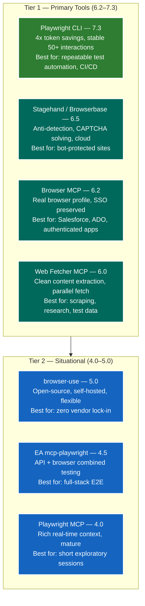
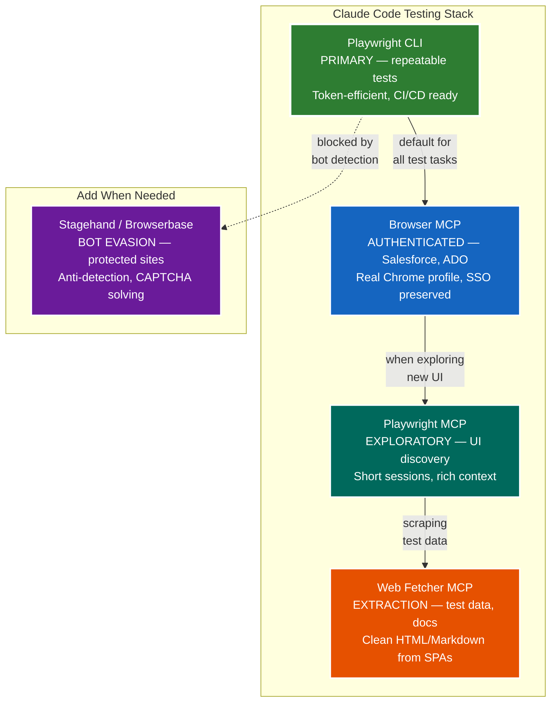

# TEG One-Pager: Claude Code Testing & Browser Automation Tools — Analysis of Alternatives

**Date:** 2026-03-14
**Author:** Anthony Dourish
**Status:** Proposal
**Related:** [AI Coding Tools AoA](TEG-AoA-AI-Coding-Tools-v1.0.md)

---

## Executive Summary

Seven browser automation and testing tools were evaluated for use with Claude Code across token efficiency, session stability, authentication handling, bot evasion, content extraction, cost, and QA workflow fit. The field splits into three categories: **MCP-based tools** (run inside the AI context window), **CLI-based tools** (run via shell commands, state on disk), and **cloud-hosted platforms** (remote browser execution).

### Key Takeaways

1. **Playwright CLI is the recommended upgrade from Playwright MCP.** Microsoft's own benchmarks show ~27,000 tokens per task vs. ~114,000 for MCP — a **4x reduction**. Sessions that degraded after 15 browser interactions with MCP now run stable for 50+ with CLI. CLI saves snapshots and screenshots to disk; the agent reads only what it needs. For Claude Code users already on Playwright MCP, switching to CLI is the highest-impact, lowest-effort improvement.

2. **Playwright MCP remains the default for exploratory testing and self-QA.** When the agent needs to interactively explore a UI — click, inspect, decide, click again — MCP's inline accessibility tree gives the model richer real-time context than CLI file reads. The token cost is worth it for short, discovery-oriented sessions (< 15 interactions).

3. **Browser MCP is the only option that uses your actual browser profile.** It controls your real Chrome instance — cookies, sessions, saved logins all preserved. When the agent hits a CAPTCHA, it pauses and waits for you to solve it in the same browser window, then continues automatically. This is the best option for testing authenticated apps like Salesforce, ADO, or internal portals where headless browsers get blocked.

4. **Stagehand (Browserbase) is the anti-detection specialist.** Built-in stealth mode, IP rotation, proxy support, and CAPTCHA solving. Cloud-hosted with session recording and live view. Choose this when target sites actively block automation. Stagehand v3.0 provides 20-40% faster performance with automatic caching.

5. **browser-use is the open-source, self-hosted flexible option.** Free, runs locally with your own API keys. Full browser control — navigate, fill forms, click, extract. Best for teams that want zero vendor lock-in and full control over the automation stack.

6. **Web Fetcher MCP is purpose-built for content extraction, not interaction.** Uses Playwright under the hood but focuses on returning clean HTML/Markdown from JavaScript-heavy pages. Blocks images, fonts, and ads automatically. Run it alongside Playwright MCP/CLI for scraping and research automation.

7. **executeautomation/mcp-playwright is a community alternative with API testing.** Adds REST API testing tools alongside browser automation — useful for full-stack E2E validation but less mature than the official Microsoft server.

8. **The optimal stack is layered — no single tool covers every testing scenario.** Use Playwright CLI for repeatable test flows, Playwright MCP for exploratory sessions, and Browser MCP for authenticated app testing. Add Stagehand only when sites block automation.

### Recommendations at a Glance

| Scenario | Recommended Tool | Rationale |
|---|---|---|
| **Repeatable test automation** | **Playwright CLI** | 4x token savings, stable long sessions, CI/CD friendly |
| **Exploratory UI testing** | **Playwright MCP** | Rich real-time context, interactive discovery |
| **Authenticated app testing** (Salesforce, ADO) | **Browser MCP** | Uses real browser profile, preserves sessions |
| **Bot-protected sites** | **Stagehand / Browserbase** | Anti-detection, stealth, CAPTCHA solving |
| **Content extraction / scraping** | **Web Fetcher MCP** | Clean HTML/Markdown, parallel fetch, blocks cruft |
| **Open-source / self-hosted** | **browser-use** | Free, local, full control, no vendor lock-in |
| **Full-stack E2E (API + browser)** | **executeautomation/mcp-playwright** | Combined REST API + browser testing |

---

## Problem Statement

**Current Situation:**
- Claude Code uses Playwright MCP for browser automation, which is functional but token-heavy and degrades on long sessions
- QA workflows require reliable browser automation across authenticated portals (Salesforce, ADO), public web apps, and bot-protected sites
- No formal evaluation exists comparing the growing ecosystem of testing tools available to Claude Code

**Critical Risks:**
1. **Token Waste** — Playwright MCP consumes ~114K tokens per task; at scale this exhausts Claude Code credit windows prematurely
2. **Session Instability** — MCP sessions degrade after 15-20 browser interactions, requiring restarts mid-test
3. **Authentication Barriers** — Headless browsers cannot access SSO-protected portals without explicit credential management
4. **Bot Detection** — Some target sites actively block headless automation, causing test failures
5. **No Extraction Pipeline** — Scraping JavaScript-heavy pages for test data requires a separate content extraction tool

**Impact:** Testing tool selection directly affects QA throughput, credit consumption, session reliability, and the team's ability to automate across authenticated and protected environments.

---

## Outcome Expectation

**Primary Goal:** Select a layered testing tool stack for Claude Code that maximizes token efficiency, session stability, and coverage across authenticated, public, and bot-protected sites.

**Success Metrics:**
- Token consumption per test task reduced by >= 50% vs. current Playwright MCP baseline
- Test sessions stable for >= 50 browser interactions without degradation
- Authenticated portal testing (Salesforce, ADO) automated without manual credential management
- Bot-protected site testing succeeds on first attempt >= 80% of the time
- QA team adoption >= 80% within 30 days of stack deployment

---

## Requirements

### Functional Requirements
1. Browser automation for UI testing (navigate, click, fill, assert, screenshot)
2. Token-efficient operation within Claude Code's context window
3. Stable long-running sessions (50+ browser interactions)
4. Authenticated session support for SSO-protected apps (Salesforce, ADO, EHBs)
5. Content extraction from JavaScript-heavy pages
6. API testing capability alongside browser testing
7. CI/CD pipeline integration for automated regression

### Non-Functional Requirements
1. **Security:** No credential leakage; sessions isolated per test run
2. **Reliability:** Consistent results across repeated test executions
3. **Performance:** Test task completion within acceptable time bounds
4. **Cost:** Token/credit consumption justified by test coverage gains
5. **Compliance:** Tools must not introduce security vulnerabilities or unauthorized data exfiltration

---

## Design Details

### Options Analysis — Full Comparison

| **Criteria** | **Playwright CLI** | **Playwright MCP** | **Browser MCP** | **Stagehand / Browserbase** | **browser-use** | **Web Fetcher MCP** | **EA mcp-playwright** |
|---|---|---|---|---|---|---|---|
| **Publisher** | Microsoft | Microsoft | Community (nicholasoxford) | Browserbase | Community (open-source) | Community (jae-jae) | Execute Automation |
| **Architecture** | CLI (shell commands) | MCP (JSON-RPC) | MCP (JSON-RPC) | MCP + Cloud | MCP (HTTP or local) | MCP (JSON-RPC) | MCP (JSON-RPC) |
| **Token Efficiency** | ✅ 10/10 — ~27K tokens/task; 4x less than MCP; state on disk, agent reads selectively | ⚠️ 4/10 — ~114K tokens/task; full accessibility tree + screenshots in context window | ⚠️ 5/10 — Similar to Playwright MCP but real browser reduces retry tokens | ⚠️ 5/10 — Cloud reduces local context but MCP transport is still verbose | ⚠️ 5/10 — MCP-based; comparable to Playwright MCP | ✅ 8/10 — Lightweight; returns clean text/markdown only, no DOM trees | ⚠️ 5/10 — MCP-based; comparable to Playwright MCP |
| **Session Stability** | ✅ 10/10 — 50+ interactions; state on disk, no context degradation | ⚠️ 5/10 — Degrades after 15-20 interactions; context window bloat | ✅ 8/10 — Real browser holds state; no headless session drops | ✅ 8/10 — Cloud sessions persistent; caching in v3.0 | ⚠️ 6/10 — Depends on local resources; no inherent session management | ✅ 9/10 — Stateless fetch; no session to degrade | ⚠️ 5/10 — Same MCP session limitations as Playwright MCP |
| **Authentication Support** | ⚠️ 4/10 — Headless; requires explicit credential setup; no saved sessions | ⚠️ 4/10 — Headless; same limitation | ✅ 10/10 — Uses YOUR real Chrome profile; cookies, SSO, MFA all preserved | ⚠️ 6/10 — Cloud sessions; can configure auth but no local profile | ⚠️ 5/10 — Can configure auth; no profile reuse | ❌ 2/10 — Fetch-only; no interactive auth | ⚠️ 4/10 — Headless; same as Playwright MCP |
| **Bot Evasion** | ❌ 2/10 — Standard headless fingerprint; easily detected | ❌ 2/10 — Same | ✅ 8/10 — Real browser profile; appears as normal user | ✅ 10/10 — Purpose-built stealth; IP rotation, proxy, anti-fingerprinting | ⚠️ 5/10 — Can configure stealth plugins | ❌ 2/10 — Headless fetch; detectable | ❌ 2/10 — Standard headless |
| **Content Extraction** | ⚠️ 5/10 — Can screenshot and read DOM; not optimized for extraction | ⚠️ 5/10 — Same | ⚠️ 5/10 — Same | ✅ 7/10 — Session recording + extraction | ⚠️ 6/10 — Can extract via DOM access | ✅ 10/10 — Purpose-built; Readability algo; parallel multi-URL; blocks cruft | ⚠️ 5/10 — Basic DOM access |
| **API Testing** | ❌ 1/10 — Browser-only | ❌ 1/10 — Browser-only | ❌ 1/10 — Browser-only | ❌ 1/10 — Browser-only | ❌ 1/10 — Browser-only | ❌ 1/10 — Content extraction only | ✅ 8/10 — Built-in REST API testing tools |
| **CI/CD Fit** | ✅ 10/10 — Shell commands; perfect for pipeline scripts | ⚠️ 4/10 — Requires MCP host; not pipeline-native | ❌ 2/10 — Requires running Chrome instance; not headless CI friendly | ✅ 7/10 — Cloud-hosted; API-triggerable for CI | ⚠️ 5/10 — Can be scripted; requires local setup | ✅ 8/10 — Stateless fetch; easy to script | ⚠️ 4/10 — MCP-based; same CI limitations |
| **Multi-Browser** | ✅ Chromium, Firefox, WebKit | ✅ Chromium, Firefox, WebKit | ❌ Chrome only (real profile) | ✅ Chromium (cloud instances) | ✅ Chromium (primary) | ✅ Chromium (headless) | ✅ Chromium, Firefox |
| **CAPTCHA Handling** | ❌ None | ❌ None | ✅ Pause + human solve + resume | ✅ Auto-solve (cloud service) | ❌ None | ❌ N/A | ❌ None |
| **Cost** | ✅ Free (npm install) | ✅ Free (npm install) | ✅ Free (npm install) | ⚠️ Freemium — free tier; paid for volume/stealth | ✅ Free (open-source) | ✅ Free (npm/docker) | ✅ Free (npm install) |
| **Setup Complexity** | ✅ Low — `npm i -g @playwright/cli` | ✅ Low — MCP config in settings | ⚠️ Medium — requires Chrome profile path config | ⚠️ Medium — API key + cloud config | ⚠️ Medium — Python/uvx + API keys | ✅ Low — npx or docker | ✅ Low — MCP config |
| **Maturity** | ⚠️ New (2026) — rapidly maturing | ✅ Mature — Microsoft-backed, 25+ tools | ⚠️ Community — active but smaller | ✅ Mature — Browserbase funded, v3.0 | ⚠️ Growing — active community | ⚠️ Community — stable but niche | ⚠️ Community — moderate adoption |

---

### Weighted Scoring Matrix

Criteria are weighted by QA workflow impact. Token efficiency and session stability are the highest-weighted criteria because they directly affect test throughput and credit consumption.

| **Criterion** | **Weight** | **Playwright CLI** | **Playwright MCP** | **Browser MCP** | **Stagehand** | **browser-use** | **Web Fetcher** | **EA mcp-pw** |
|---|---|---|---|---|---|---|---|---|
| ⭐ Token Efficiency | 20% | 10 | 4 | 5 | 5 | 5 | 8 | 5 |
| ⭐ Session Stability | 18% | 10 | 5 | 8 | 8 | 6 | 9 | 5 |
| ⭐ Authentication Support | 15% | 4 | 4 | 10 | 6 | 5 | 2 | 4 |
| ⭐ CI/CD Fit | 12% | 10 | 4 | 2 | 7 | 5 | 8 | 4 |
| Bot Evasion | 10% | 2 | 2 | 8 | 10 | 5 | 2 | 2 |
| Content Extraction | 8% | 5 | 5 | 5 | 7 | 6 | 10 | 5 |
| API Testing | 5% | 1 | 1 | 1 | 1 | 1 | 1 | 8 |
| Multi-Browser | 4% | 10 | 10 | 3 | 7 | 7 | 7 | 8 |
| CAPTCHA Handling | 4% | 1 | 1 | 8 | 10 | 1 | 1 | 1 |
| Setup Simplicity | 4% | 9 | 8 | 6 | 6 | 6 | 8 | 8 |
| **Weighted Total** | **100%** | **7.3** | **4.0** | **6.2** | **6.5** | **5.0** | **6.0** | **4.5** |

---

### Scoring Summary



---

## Tool Profiles

### Tool 1: Playwright CLI *(Recommended Primary)*

**Publisher:** Microsoft
**Package:** `@playwright/cli` (npm)
**Install:** `npm install -g @playwright/cli@latest`

**How It Works:**
Unlike MCP, Playwright CLI uses shell commands that save browser state to disk. The agent runs commands like `playwright-cli navigate`, `playwright-cli click`, `playwright-cli screenshot` and reads results from files. The model never processes a 10,000-token accessibility tree or 50,000-token screenshot inline — it gets compact element references (`e8`, `e21`) and uses them directly.

**Key Metrics:**
- ~27,000 tokens per task (vs. ~114,000 for MCP)
- Stable for 50+ interactions (vs. 15-20 for MCP)
- 4-10x token reduction reported by early adopters

**Pros:**
- ✅ 4x token efficiency — extends Claude Code credit window significantly
- ✅ Stable long sessions — no context degradation
- ✅ CI/CD native — shell commands fit any pipeline
- ✅ Multi-browser: Chromium, Firefox, WebKit
- ✅ Free, Microsoft-backed

**Cons:**
- ❌ Headless only — no preserved auth sessions
- ❌ No bot evasion — standard headless fingerprint
- ❌ New (early 2026) — still rapidly evolving
- ❌ Less interactive than MCP for real-time exploration

**Best For:** Repeatable test automation, CI/CD pipelines, long test sessions, token-conscious workflows.

---

### Tool 2: Playwright MCP *(Current Default)*

**Publisher:** Microsoft
**Package:** `@playwright/mcp` (npm)
**Install:** MCP config in Claude Code settings

**How It Works:**
Implements the Model Context Protocol with 25+ browser control tools. Returns full accessibility trees and screenshots directly into the AI context window. The model sees the page structure in real-time and makes decisions interactively.

**Key Metrics:**
- ~114,000 tokens per task
- Degrades after 15-20 interactions
- 25+ exposed tools (navigate, click, fill, screenshot, etc.)

**Pros:**
- ✅ Rich real-time page context — accessibility tree inline
- ✅ Mature, well-documented, Microsoft-backed
- ✅ Best for short exploratory sessions
- ✅ Multi-browser support

**Cons:**
- ❌ Token-heavy — 4x more than CLI
- ❌ Session degradation after 15-20 interactions
- ❌ Headless — no auth session preservation
- ❌ Not CI/CD native

**Best For:** Short exploratory testing sessions, self-QA during development, interactive UI discovery.

---

### Tool 3: Browser MCP *(Authenticated App Testing)*

**Publisher:** Community (nicholasoxford/playwriter)
**Architecture:** MCP server controlling real Chrome instance

**How It Works:**
Unlike all other tools, Browser MCP controls your **actual local Chrome browser** — not a headless instance. You stay logged into Salesforce, ADO, EHBs, and any SSO-protected portal. When the agent encounters a CAPTCHA, it **pauses, waits for you to solve it in the same browser window**, watches you complete it, and continues automatically.

**Key Differentiator:** The only tool with native "pause and attach" — the AI controls your real Chrome, and when it can't proceed, it stops and lets you take over.

**Pros:**
- ✅ Real browser profile — cookies, SSO, MFA all preserved
- ✅ CAPTCHA pause-and-resume — human-in-the-loop where needed
- ✅ Appears as normal user — minimal bot detection
- ✅ Perfect for Salesforce, ADO, internal portals
- ✅ Free

**Cons:**
- ❌ Chrome only — no Firefox/WebKit
- ❌ Not CI/CD friendly — requires running Chrome instance
- ❌ Community-maintained — smaller support base
- ❌ Cannot run headless/parallel

**Best For:** Testing authenticated web applications (Salesforce org testing, ADO interaction, EHBs portal verification, internal HRSA tools).

---

### Tool 4: Stagehand / Browserbase *(Bot Evasion Specialist)*

**Publisher:** Browserbase (funded startup)
**Package:** `@browserbasehq/mcp-server-browserbase`
**Architecture:** Cloud-hosted browser + MCP

**How It Works:**
Runs browsers in the cloud with built-in anti-detection. Natural language commands (`stagehand_act: "Click the login button"`) instead of CSS selectors. Session recording, live view, proxy rotation, and CAPTCHA auto-solving included.

**Pros:**
- ✅ Best-in-class bot evasion — stealth, proxy, anti-fingerprinting
- ✅ CAPTCHA auto-solving
- ✅ Session recording and live view
- ✅ Natural language actions — no selectors needed
- ✅ Cloud-hosted — no local browser management
- ✅ v3.0: 20-40% faster with automatic caching

**Cons:**
- ⚠️ Freemium — free tier limited; paid for production volume
- ❌ Cloud dependency — requires internet, adds latency
- ❌ No local browser profile — auth must be configured per session
- ⚠️ Medium setup complexity (API key + config)

**Best For:** Testing bot-protected sites, scraping behind Cloudflare/reCAPTCHA, testing sites with strict security measures.

---

### Tool 5: browser-use *(Open-Source Flexible)*

**Publisher:** Community (open-source)
**Install:** `uvx browser-use --mcp` (local) or cloud hosted
**Architecture:** MCP server (HTTP or local)

**How It Works:**
Wraps a real browser as an MCP server. Full control: navigate, click, fill forms, extract data. Self-hosted with your own API keys — zero vendor dependency.

**Pros:**
- ✅ Open-source — full control, no vendor lock-in
- ✅ Free (self-hosted with own API keys)
- ✅ Flexible — can be customized for any workflow
- ✅ Active community

**Cons:**
- ⚠️ Requires own API keys (OpenAI or Anthropic)
- ⚠️ More setup than npm install
- ❌ No built-in stealth or CAPTCHA handling
- ⚠️ Session management depends on local resources

**Best For:** Teams wanting full control with zero vendor dependency.

---

### Tool 6: Web Fetcher MCP *(Content Extraction)*

**Publisher:** Community (jae-jae)
**Install:** `npx -y @mcp/fetcher` or Docker
**Architecture:** MCP server using Playwright headless

**How It Works:**
Fetches web pages using Playwright, applies Mozilla's Readability algorithm to extract main content, returns clean HTML or Markdown. Automatically blocks images, fonts, ads, and stylesheets. Supports parallel multi-URL fetch.

**Pros:**
- ✅ Purpose-built for clean content extraction
- ✅ Handles JavaScript-heavy SPAs
- ✅ Parallel multi-URL fetch for batch operations
- ✅ Minimal token footprint — returns text only
- ✅ Free, Docker-friendly

**Cons:**
- ❌ Extraction only — no interactive testing
- ❌ No authentication support
- ❌ No form filling, clicking, or assertions

**Best For:** Scraping test data, extracting requirements from web portals, research automation, feeding content into test generation workflows.

---

### Tool 7: executeautomation/mcp-playwright *(Full-Stack E2E)*

**Publisher:** Execute Automation (community)
**Package:** `@anthropic/mcp-playwright` (archived) → community fork
**Architecture:** MCP server

**How It Works:**
Community Playwright MCP server that adds REST API testing tools alongside browser automation. Supports API calls (GET, POST, PUT, DELETE) within the same MCP session as browser actions.

**Pros:**
- ✅ Combined API + browser testing in one session
- ✅ Useful for full-stack E2E validation
- ✅ Free, open-source

**Cons:**
- ⚠️ Less mature than official Microsoft server
- ❌ Same MCP token/session limitations as Playwright MCP
- ❌ No bot evasion or auth profile support
- ⚠️ Original Anthropic package archived; community-maintained

**Best For:** Full-stack E2E testing where API calls and browser interactions are needed in the same test flow.

---

## Recommended Stack

### For BPHC GAM 2.0 / Salesforce Development



### Installation Commands

```bash
# 1. Playwright CLI — primary testing tool
npm install -g @playwright/cli@latest

# 2. Playwright MCP — exploratory testing (add to Claude Code MCP config)
# In .claude/settings.json or claude_desktop_config.json:
# "mcpServers": { "playwright": { "command": "npx", "args": ["@playwright/mcp@latest"] } }

# 3. Browser MCP — authenticated app testing
# "mcpServers": { "browser": { "command": "npx", "args": ["browser-mcp"] } }

# 4. Web Fetcher MCP — content extraction
# "mcpServers": { "fetcher": { "command": "npx", "args": ["-y", "@mcp/fetcher"] } }

# 5. Stagehand (optional — when needed for bot evasion)
# "mcpServers": { "browserbase": { "command": "npx", "args": ["@browserbasehq/mcp-server-browserbase"], "env": { "BROWSERBASE_API_KEY": "..." } } }
```

### Decision Tree

```
Need to test something in a browser?
│
├── Is it a repeatable test flow?
│   └── YES → Playwright CLI (token-efficient, CI/CD ready)
│
├── Is it an authenticated app (Salesforce, ADO, EHBs)?
│   └── YES → Browser MCP (real Chrome profile, SSO preserved)
│
├── Are you exploring an unfamiliar UI?
│   └── YES → Playwright MCP (rich real-time context, < 15 interactions)
│
├── Is the site blocking automation?
│   └── YES → Stagehand / Browserbase (stealth, CAPTCHA solving)
│
├── Do you need to extract content from a page?
│   └── YES → Web Fetcher MCP (clean markdown, parallel fetch)
│
└── Do you need API + browser in one session?
    └── YES → executeautomation/mcp-playwright (combined API + browser)
```

---

## Migration Plan — Playwright MCP → Playwright CLI

### Phase 1: Install (Day 1)
```bash
npm install -g @playwright/cli@latest
playwright-cli --help
```

Claude Code auto-detects the CLI and uses it for browser automation tasks. No MCP config changes needed — CLI and MCP can coexist.

### Phase 2: Parallel Run (Week 1)
- Run existing test workflows with both CLI and MCP
- Compare token consumption (expect 4x reduction with CLI)
- Verify session stability at 30+ interactions

### Phase 3: Default Switch (Week 2)
- Set CLI as default for all repeatable test flows
- Keep MCP available for exploratory sessions only
- Add Browser MCP for Salesforce/ADO authenticated testing

### Phase 4: Full Stack (Week 3+)
- Add Web Fetcher for content extraction workflows
- Evaluate Stagehand if bot-protected sites are encountered
- Document tool selection criteria in CLAUDE.md for team

---

## Cost Analysis

| Tool | License Cost | Token Cost per Task | Infrastructure |
|---|---|---|---|
| Playwright CLI | Free | ~27K tokens (~$0.08 Sonnet) | Local |
| Playwright MCP | Free | ~114K tokens (~$0.34 Sonnet) | Local |
| Browser MCP | Free | ~60-80K tokens (~$0.20 Sonnet) | Local (Chrome) |
| Stagehand Free | Free (limited) | ~60K tokens + API calls | Cloud (Browserbase) |
| Stagehand Paid | ~$50-200/mo | ~60K tokens + API calls | Cloud (Browserbase) |
| browser-use | Free | ~60-80K tokens + own API keys | Local |
| Web Fetcher | Free | ~10-20K tokens (~$0.05 Sonnet) | Local/Docker |
| EA mcp-playwright | Free | ~100K tokens (~$0.30 Sonnet) | Local |

**Bottom line:** Switching from Playwright MCP to Playwright CLI saves ~$0.26 per test task on Sonnet token costs. Over 100 tasks/week, that's ~$26/week or ~$104/month in token savings alone — plus the credit window extends further before exhaustion.

---

## Document Version History

| Version | Date | Author | Changes |
|---|---|---|---|
| 1.0 | 2026-03-14 | Anthony Dourish / Claude Code | Initial AoA — 7 testing tools evaluated; weighted scoring; recommended layered stack; migration plan from Playwright MCP to CLI |

---

## Sources

- [Playwright CLI: Token-Efficient Alternative to Playwright MCP](https://testcollab.com/blog/playwright-cli)
- [Playwright CLI vs MCP: Key Differences](https://testdino.com/blog/playwright-cli-vs-mcp/)
- [Playwright MCP vs CLI: Which One Should Your AI Agent Use?](https://www.test-lab.ai/blog/playwright-mcp-vs-cli-agentic-testing)
- [CLI vs MCP: Technical Comparison for Playwright Browser Automation](https://www.joanmedia.dev/ai-blog/cli-vs-mcp-the-technical-comparison-for-playwright-browser-automation)
- [How to Use Playwright MCP Server with Claude Code](https://www.builder.io/blog/playwright-mcp-server-claude-code)
- [Building an AI QA Engineer with Claude Code and Playwright MCP](https://alexop.dev/posts/building_ai_qa_engineer_claude_code_playwright/)
- [Using Playwright MCP with Claude Code — Simon Willison](https://til.simonwillison.net/claude-code/playwright-mcp-claude-code)
- [6 Most Popular Playwright MCP Servers for AI Testing](https://bug0.com/blog/playwright-mcp-servers-ai-testing)
- [Top Playwright MCP Alternatives in 2026](https://fastmcp.me/blog/top-playwright-mcp-alternatives)
- [5 Best MCP Servers for Browser Automation in 2026](https://dev.to/custodiaadmin/the-5-best-mcp-servers-for-browser-automation-in-2026-25ip)
- [Browserbase MCP Server Configuration — Stagehand](https://docs.stagehand.dev/v3/integrations/mcp/configuration)
- [browser-use MCP Server Documentation](https://docs.browser-use.com/customize/integrations/mcp-server)
- [Web Fetcher MCP Server — GitHub](https://github.com/jae-jae/fetcher-mcp)
- [Playwright MCP Changes the Build vs. Buy Equation for AI Testing](https://bug0.com/blog/playwright-mcp-changes-ai-testing-2026)
- [Playwright vs Puppeteer: Which to Choose in 2026 — BrowserStack](https://www.browserstack.com/guide/playwright-vs-puppeteer)
